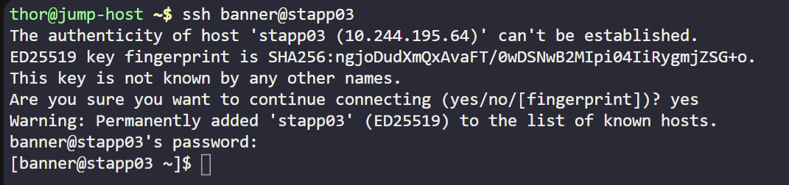
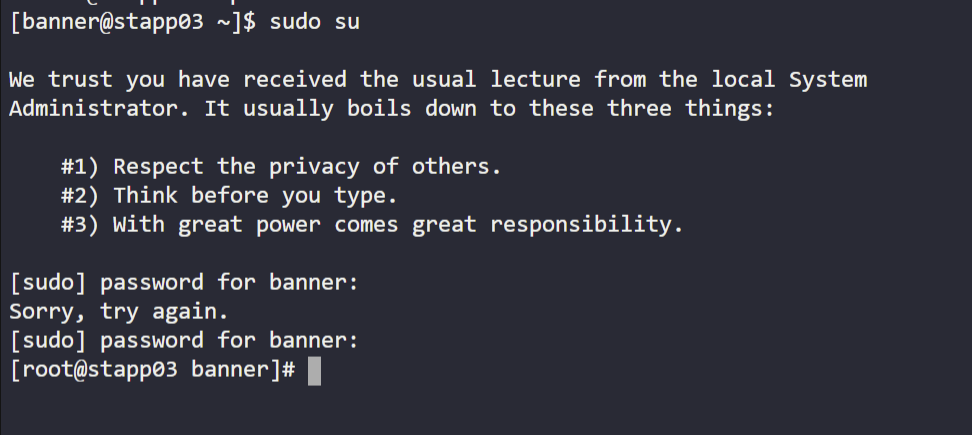
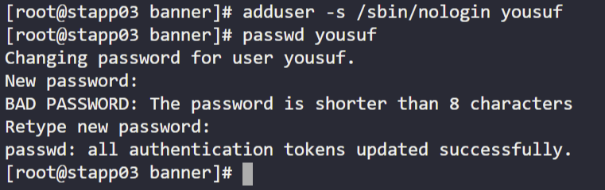
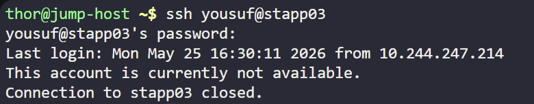

# Day 01 — Linux User Setup

**Date:** 2026-05-25 | **Duration:** ~0.5h | **Status:** ✅ Complete

---

## 🎯 Objective

Create a new Linux user named `yousuf` with a non-interactive shell on App Server 3 to satisfy the backup agent tool requirement.

---

## 📋 Problem Statement

The system administrator team at xFusionCorp Industries needs a user account for the backup agent tool. The account must be created with a non-interactive shell so it cannot be used for normal logins.

Key requirements:
- Create a user named `yousuf`
- Assign a non-interactive shell
- Apply the change on App Server 3 (`stapp03`)

---

## 📚 Prerequisites

- Access to App Server 3 (`stapp03`) with sufficient privileges to create users
- SSH access to `stapp03`
- Ability to escalate to root with `sudo su`
- Knowledge of non-interactive shells such as `/sbin/nologin`

**Step 1 Screenshot (SSH to App Server 3):**



---

## 💻 Step-by-Step Solution

### Step 1: SSH to App Server 3 (stapp03)

**Description:**
Connect to App Server 3 using the challenge-provided SSH credentials.

**Commands:**
```bash
ssh <username>@stapp03
```

**Expected Output:**
```
# login prompt or direct shell on stapp03
```

---

### Step 2: Become root on the server

**Description:**
Use `sudo su` to switch to the root user before creating the system account.

**Commands:**
```bash
sudo su
```

**Expected Output:**
```
# root prompt, e.g. root@stapp03:/#
```

**Screenshot:**


---

### Step 3: Create the `yousuf` user with a non-interactive shell

**Description:**
Create the `yousuf` user and set its login shell to `/sbin/nologin` so it cannot be used for interactive logins.

**Commands:**
```bash
adduser -s /sbin/nologin yousuf
passwd yousuf
```

**Expected Output:**
```
Changing password for user yousuf.
New password:
Retype new password:
passwd: all authentication tokens updated successfully.
```

**Screenshot:**


---

### Step 4: Confirm the account cannot log in interactively

**Description:**
From a new terminal or host, attempt to SSH as `yousuf` and verify the account is not available for login.

**Commands:**
```bash
ssh yousuf@stapp03
```

**Expected Output:**
```
This account is currently not available.
```

**Screenshot:**


---

## ✅ Verification

**How to verify the solution is correct:**
- [ ] Confirm the `yousuf` user exists in `/etc/passwd`
- [ ] Confirm the shell is set to `/sbin/nologin`
- [ ] Confirm SSH login as `yousuf` returns `This account is currently not available.`

**Verification Commands:**
```bash
ssh yousuf@stapp03
```

**Final Screenshot (Evidence of Completion):**


---

## 📊 Results & Evidence

| Item | Details |
|------|---------|
| **Status** | ✅ Success |
| **Time Taken** | ~0.5h |
| **Key Output** | `yousuf` created with `/sbin/nologin` shell |
| **Challenges** | Verified non-interactive login behavior from a separate terminal |

---

## 🔑 Key Concepts Learned

1. **Linux user creation** — Creating a new user account with `adduser`
2. **Non-interactive shell configuration** — Using `/sbin/nologin` to block interactive logins
3. **Verification across terminals** — Testing login behavior from a separate terminal session

---

## ⚠️ Common Mistakes & Troubleshooting

### Issue 1: Wrong shell path
**Cause:** Using an interactive shell instead of `/sbin/nologin`
**Solution:** Update the shell with `usermod` or recreate the user with the correct shell

```bash
usermod -s /sbin/nologin yousuf
```

### Issue 2: User cannot be created without root access
**Cause:** Running `adduser` without sufficient privileges
**Solution:** Use `sudo su` first or run the command with `sudo`

```bash
sudo adduser -s /sbin/nologin yousuf
```

---

## 📌 Key Takeaways

- **What worked well:** SSH to App Server 3, switching to root, and creating the non-interactive service user
- **What was challenging:** Confirming the login attempt from a separate terminal returned the expected account restriction
- **Next steps:** Continue documenting the remaining challenge days with the same step-by-step approach

---

## 🔗 Resources & References

- [Linux `adduser` man page](https://man7.org/linux/man-pages/man8/adduser.8.html)
- [Linux `nologin` shell documentation](https://man7.org/linux/man-pages/man8/nologin.8.html)
- [Linux user account management](https://linux.die.net/man/8/useradd)

---

## 📁 Files & Configurations

### Files Created/Modified:
- `README.md` — Day 1 challenge documentation and solution summary

### Useful Commands:
```bash
ssh <username>@stapp03
sudo su
adduser -s /sbin/nologin yousuf
passwd yousuf
ssh yousuf@stapp03
```

---

## 🏷️ Tags

`linux` `user-management` `security` `backup-agent` `shell`

---

## 📝 Notes

- The `yousuf` account is configured for non-interactive use only.
- SSH login as `yousuf` should be blocked by the non-interactive shell.
- Use the provided challenge credentials when connecting to `stapp03`.

---

**Challenge Completed:** ✅ YES
**Difficulty Level:** ⭐⭐ (1-5 stars)
**Time Investment:** Worth it ✅
