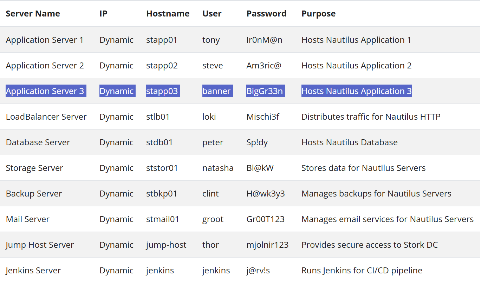
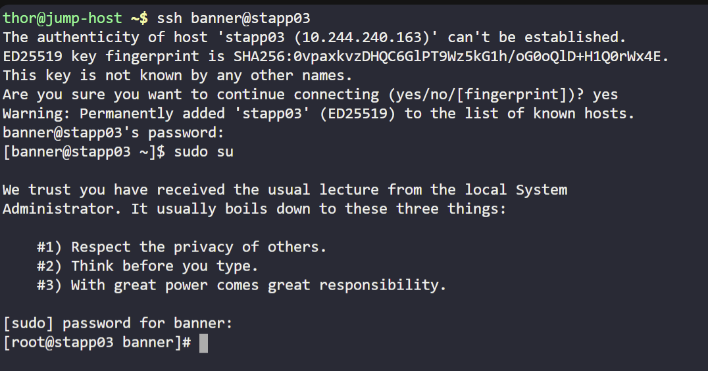
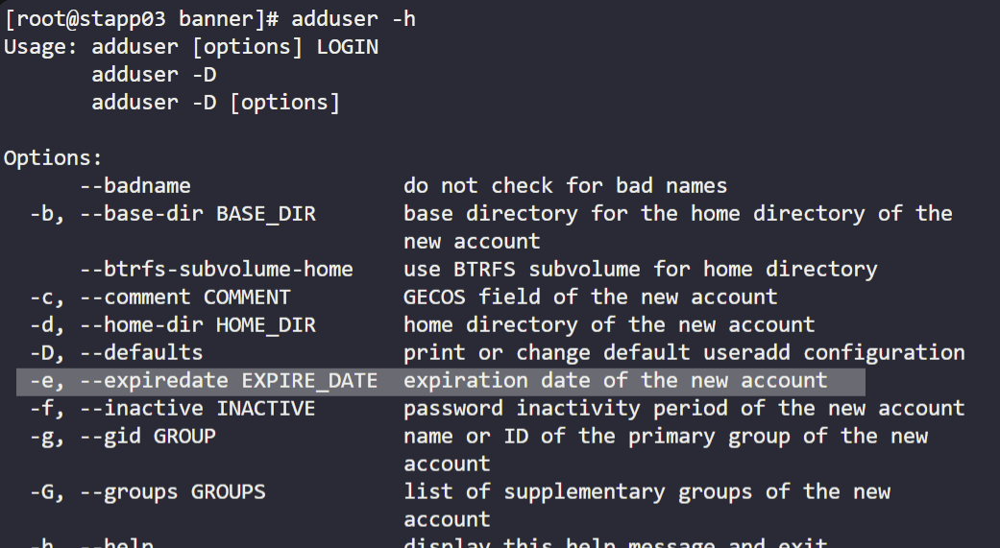
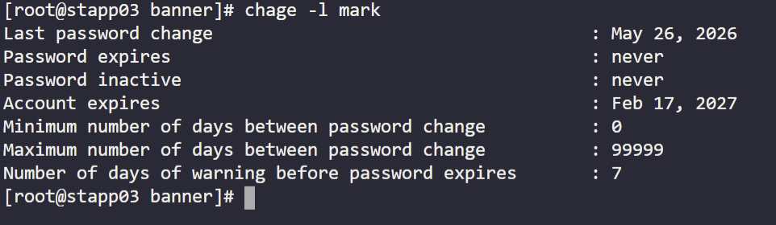

As part of the temporary assignment to the Nautilus project, a developer named mark requires access for a limited duration. To ensure smooth access management, a temporary user account with an expiry date is needed. Here's what you need to do:

Create a user named mark on App Server 3 in Stratos Datacenter. Set the expiry date to 2027-02-17, ensuring the user is created in lowercase as per standard protocol.

Note: You can find the infrastructure details by clicking on the Details of all Users and Servers button on the top-right section of the page. (screenshot below)

ssh to app server 3
sudo su
Screenshot below

adduser -h 
Screenshot for help documentation (highlighted)

adduser -e 2027-02-17 mark

to check details
chage -l mark
screenshot for confirmation output

