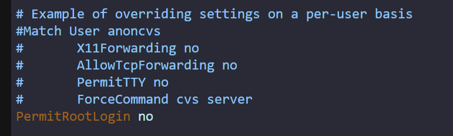
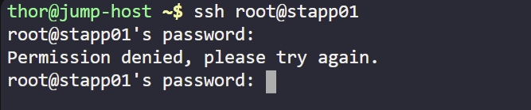

Following security audits, the xFusionCorp Industries security team has rolled out new protocols, including the restriction of direct root SSH login.

Your task is to disable direct SSH root login on all app servers within the Stratos Datacenter.

Login to each webserver (Application Server 1 & 2 & 3)
ssh <user>@<hostname> 
sudo su

vi etc/ssh/sshd_config

search for permit root login
set it to no

restart the ssh service
systemctl restart sshd

from a new terminal check if sign in to root is done or not

as expected permission is to be denied

redo the same to the rest app servers 
