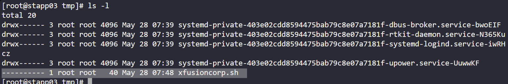
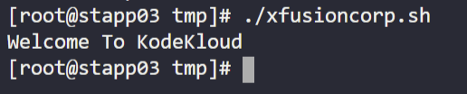
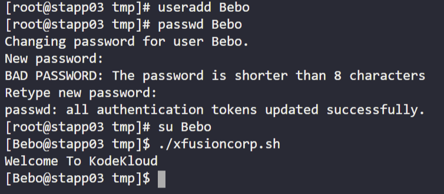

# Day 4 — Script Execution Permissions

**Date:** 2026-05-28 | **Duration:** ~0.2h | **Status:** ✅ Complete

---

## 🎯 Objective

Grant executable permissions to the `/tmp/xfusioncorp.sh` script on App Server 3 in the Stratos Datacenter, ensuring all users can execute it.

---

## 📋 Problem Statement

The xFusionCorp Industries sysadmin team has developed a bash script named `xfusioncorp.sh` and distributed it to all necessary servers. However, the script lacks executable permissions on App Server 3 within the Stratos Datacenter.

**Requirements:**
- Connect to App Server 3
- Add executable permissions to `/tmp/xfusioncorp.sh`
- Ensure all users have the capability to execute the script
- Verify the script works for both root and regular users

---

## 📚 Prerequisites

- SSH access to App Server 3
- Sudo privileges to modify file permissions
- Basic knowledge of Linux file permissions and chmod command

---

## 💻 Step-by-Step Solution

### Step 1: Connect to App Server 3 and Obtain Root Access

**Description:**
Establish SSH connection to App Server 3 and escalate to root user for administrative tasks.

**Commands:**
```bash
ssh <user>@<hostname>
sudo su
```

**Expected Output:**
```
Successful SSH connection and root prompt (#)
```

---

### Step 2: Navigate to /tmp/ and Check Current Permissions

**Description:**
Move to the /tmp/ directory where the script is located and verify its current permissions.

**Commands:**
```bash
cd /tmp/
ls -l xfusioncorp.sh
```

**Expected Output:**
```
---------- 1 root root xfusioncorp.sh  (No permissions initially)
```

**Screenshot:**


---

### Step 3: Update Script Permissions

**Description:**
Grant read (r) and execute (x) permissions to the script so that bash can access it and all users can execute it.

**Commands:**
```bash
chmod +rx ./xfusioncorp.sh
```

**Expected Output:**
```
-r-xr-xr-x 1 root root xfusioncorp.sh
```

---

### Step 4: Verify Permissions and Test Execution

**Description:**
Verify that the permissions have been correctly applied and test the script execution by:
1. Running the script as root user
2. Creating a test user and running the script to confirm all users can execute it

**Commands:**
```bash
./xfusioncorp.sh  # Execute as root
useradd testuser  # Create a test user
su - testuser
/tmp/xfusioncorp.sh  # Execute as test user
```

**Expected Output:**
```
Script executes successfully for both root and regular users
```

**Screenshot (Root User Execution):**


**Screenshot (Test User Execution):**


---

## ✅ Verification

**How to verify the solution is correct:**
- [ ] Script permissions changed from `----------` to `-r-xr-xr-x`
- [ ] Root user can execute the script successfully
- [ ] Regular users can execute the script successfully
- [ ] `ls -l` confirms read and execute permissions are set

**Verification Command:**
```bash
ls -l /tmp/xfusioncorp.sh
```

**Expected Output:**
```
-r-xr-xr-x 1 root root xfusioncorp.sh
```

---

## 📊 Results & Evidence

| Item | Details |
|------|---------|
| **Status** | ✅ Success |
| **Time Taken** | ~0.2h |
| **Key Achievement** | Successfully granted read and execute permissions to xfusioncorp.sh |
| **Permissions Set** | `chmod +rx` (r-xr-xr-x) |
| **Tested By** | Root user and newly created test user |

---

## 🔑 Key Concepts

- **File Permissions in Linux:** Understanding rwx (read, write, execute) for user, group, and others
- **chmod Command:** Modifying file permissions using symbolic notation (+rx)
- **Script Execution:** How bash interprets and runs shell scripts
- **Permission Hierarchy:** How permissions affect different user categories

---
