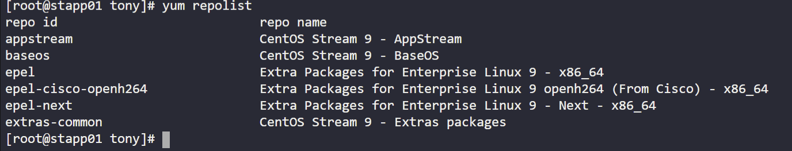
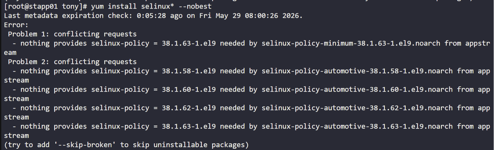
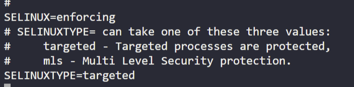
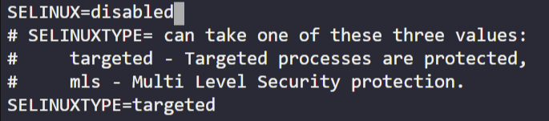

# Day 05 — SELinux Installation & Configuration

**Date:** 2026-05-29 | **Duration:** ~0.5h | **Status:** ✅ Complete

---

## 🎯 Objective

Install SELinux packages on App Server 1 and permanently disable SELinux as part of xFusionCorp Industries' security enhancement testing before enabling it with proper configurations.

---

## 📋 Problem Statement

Following a security audit, xFusionCorp Industries security team has decided to enhance application and server security with SELinux. The following requirements must be met:

- Install the required SELinux packages
- Permanently disable SELinux for the time being (to be re-enabled after configuration changes)
- Do not reboot the server (scheduled maintenance reboot planned for tonight)
- Final status after reboot should be disabled

---

## 📚 Prerequisites

- SSH access to App Server 1
- Root or sudo privileges
- CentOS/RHEL-based system (uses yum package manager)
- Internet connectivity to download packages

---

## 💻 Step-by-Step Solution

### Step 1: Connect to App Server & Obtain Root Access

**Description:**
SSH into the app server and switch to root user to perform system-wide changes.

**Commands:**
```bash
ssh <user>@<hostname>
sudo su
```

**Expected Output:**
You should see the root prompt (#) indicating root access is granted.

---

### Step 2: Prepare the System & Clean Repository Cache

**Description:**
Update the system and clean package manager cache to ensure latest repository data. This resolves potential installation conflicts.

**Commands:**
```bash
yum clean all
yum makecache
yum repolist
```

**Screenshot:**


**Expected Output:**
- `Loaded plugins...` and `Cleaning repos` messages
- Cached packages cleared
- List of enabled repositories displayed

---

### Step 3: Build Dependencies & Install SELinux Packages

**Description:**
Build necessary dependencies and install only the required SELinux packages. Using wildcards may cause conflicting packages, so specific packages are installed.

**Commands:**
```bash
yum builddep selinux-policy
yum install selinux-policy selinux-policy-targeted policycoreutils policycoreutils-python-utils -y
```

**Expected Output:**
```
Resolving Dependencies
--> Running transaction check
...
Installed:
  selinux-policy.noarch
  selinux-policy-targeted.noarch
  policycoreutils.x86_64
  policycoreutils-python-utils.noarch
Complete!
```

**Screenshot:**


**Note:** Use `-y` flag for automatic approval without interruption.

---

### Step 4: Navigate to SELinux Configuration Directory

**Description:**
Change to the SELinux configuration directory where the main configuration file resides.

**Commands:**
```bash
cd /etc/selinux
```

**Expected Output:**
You should be in the `/etc/selinux` directory with the `config` file present.

---

### Step 5: Edit SELinux Config & Disable SELinux

**Description:**
Edit the SELinux configuration file to permanently disable SELinux. Change the SELINUX parameter from its current value to "disabled".

**Commands:**
```bash
vi config
```

**Screenshot (Before):**


**Edit Instructions:**
1. Locate the line: `SELINUX=`
2. Change the value to: `SELINUX=disabled`
3. Save and quit: `ESC :wq`

**Screenshot (After):**


**Expected Output:**
The configuration file should show `SELINUX=disabled` as the value.

---

## ✅ Verification

**How to verify the solution is correct:**
- [x] SELinux packages installed successfully
- [x] `/etc/selinux/config` file contains `SELINUX=disabled`
- [x] No reboot performed
- [x] Repository cleanup resolved installation issues

**Verification Command:**
```bash
cat /etc/selinux/config | grep SELINUX=
getenforce  # Should show current mode (may not reflect config until reboot)
```

**Expected Verification Output:**
```
SELINUX=disabled
```

---

## 📊 Results & Evidence

| Item | Details |
|------|---------|
| **Status** | ✅ Success |
| **Time Taken** | ~0.5h |
| **Key Output** | SELinux disabled permanently in `/etc/selinux/config` |
| **Challenges** | Package installation conflicts resolved by cleaning repos and installing specific packages |

---

## 🔑 Key Concepts Learned

1. **SELinux Security Module** — Understanding SELinux as a mandatory access control system for Linux systems
2. **Package Management Troubleshooting** — Using `yum clean`, `yum makecache`, and `yum repolist` to resolve dependency issues
3. **System Configuration Management** — Modifying core system files like `/etc/selinux/config` to change security policies persistently

---

## ⚠️ Common Mistakes & Troubleshooting

### Issue 1: Package Conflicts During SELinux Installation
**Cause:** Using wildcards (selinux*) can cause conflicting package versions to be selected.

**Solution:** Install specific packages instead of using wildcards

```bash
yum install selinux-policy selinux-policy-targeted policycoreutils policycoreutils-python-utils -y
```

### Issue 2: Repository Not Found or Package Not Available
**Cause:** Stale repository cache or missing required repositories.

**Solution:** Clean the cache and rebuild it

```bash
yum clean all
yum makecache
yum repolist
```

### Issue 3: Changes Don't Take Effect Immediately
**Cause:** SELinux changes in the config file only take effect after system reboot.

**Solution:** This is expected behavior. Reboot the system as scheduled to apply changes.

```bash
# No immediate action needed; scheduled reboot will apply changes
```

---

## 📌 Key Takeaways

- **What worked well:** Cleaning repository cache and installing specific packages resolved all installation issues
- **What was challenging:** Initial installation conflicts with wildcard package selection; resolved through targeted package installation
- **Next steps:** After scheduled maintenance reboot, SELinux will be disabled and can be re-configured and re-enabled as per security requirements

---

## 🔗 Resources & References

- [SELinux Documentation](https://access.redhat.com/documentation/en-us/red_hat_enterprise_linux/8/html/using_selinux/index)
- [Yum Package Manager Guide](https://access.redhat.com/documentation/en-us/red_hat_enterprise_linux/8/html/installing_managing_and_removing_packages/index)
- [xFusionCorp Industries Security Policy](#)

---

## 📁 Files & Configurations

### Files Modified:
- `/etc/selinux/config` — Main SELinux configuration file (changed SELINUX=disabled)

### Packages Installed:
```
selinux-policy
selinux-policy-targeted
policycoreutils
policycoreutils-python-utils
```

---

## 🏷️ Tags

`selinux` `linux` `security` `system-administration` `centos` `rhel` `access-control`

---

## 📝 Notes

- SELinux will remain in current mode until system reboot
- The configuration change ensures SELinux remains disabled after the scheduled maintenance reboot
- Security team will enable SELinux again after necessary configuration changes are made
- This is part of a phased security enhancement testing approach

---

**Challenge Completed:** ✅ YES
**Difficulty Level:** ⭐⭐ (1-5 stars)
**Time Investment:** Worth it ✅
