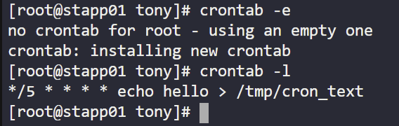

# Day 6 — Create a Cron Job

**Date:** 2026-05-30 | **Duration:** ~0.2h | **Status:** ✅ Complete

---

## 🎯 Objective

Install the cronie package on all Nautilus app servers, start the crond service, and configure a sample cron job to automatically execute a command at regular intervals.

---

## 📋 Problem Statement

The Nautilus system admins team has prepared scripts to automate several day-to-day tasks. They need to test cron job functionality on all app servers in Stratos DC before deploying actual automation scripts. The objectives are:

- Install cronie package on all Nautilus app servers
- Start and enable the crond service
- Add a sample cron job that runs every 5 minutes: `*/5 * * * * echo hello > /tmp/cron_text`
- Verify the cron job is properly configured on each server

---

## 📚 Prerequisites

- SSH access to all Nautilus app servers
- Root or sudo privileges on the servers
- Knowledge of basic cron job syntax

---

## 💻 Step-by-Step Solution

### Step 1: SSH to the First Web Server and Switch to Root User

**Description:**
Connect to the first app server via SSH and escalate to root privileges.

**Commands:**
```bash
ssh <user>@<hostname>
sudo su
```

**Expected Output:**
```
root@app-server-01:~#
```

---

### Step 2: Verify Cronie Package Installation and Start crond Service

**Description:**
Check if the cronie package is already installed. If not, install it along with its dependencies, then start the crond service.

**Commands:**
```bash
# Check crond service status
systemctl status crond

# If not installed, update system and install cronie
yum update -y && yum install cronie -y && systemctl start crond

# Enable crond to start on boot
systemctl enable crond
```

**Expected Output:**
```
Active: active (running) since ...
```

---

### Step 3: Create a New Cron Job for Root User

**Description:**
Edit the crontab for the root user and add the required cron job that writes "hello" to `/tmp/cron_text` every 5 minutes.

**Commands:**
```bash
# Open the crontab editor
crontab -e

# Add the following line in the editor
*/5 * * * * echo hello > /tmp/cron_text

# Save and exit the editor (Ctrl+X for nano, :wq for vi)

# Verify the cron job was added
crontab -l
```

**Expected Output:**
```
*/5 * * * * echo hello > /tmp/cron_text
```

**Screenshot:**


---

### Step 4: Repeat Configuration on All Remaining App Servers

**Description:**
Repeat Steps 1-3 for each additional app server in the Stratos DC to ensure consistent cron job deployment across all servers.

**Commands:**
```bash
# For each additional app server:
ssh <user>@<next-hostname>
sudo su
# Repeat Steps 2-3
```

---

## 📊 Cron Job Syntax Reference

### Cron Job Format

```cron
*/5 * * * * echo hello > /tmp/cron_text
```

**Format Breakdown:**

```text
* * * * * command
│ │ │ │ │
│ │ │ │ └─ Day of Week (0-7, where 0 and 7 are Sunday)
│ │ │ └─── Month (1-12)
│ │ └───── Day of Month (1-31)
│ └─────── Hour (0-23)
└───────── Minute (0-59)
```

**Field Explanations for Our Job:**

| Field | Value | Meaning |
|-------|-------|---------|
| Minute | `*/5` | Every 5 minutes |
| Hour | `*` | Every hour |
| Day of Month | `*` | Every day of the month |
| Month | `*` | Every month |
| Day of Week | `*` | Every day of the week |
| Command | `echo hello > /tmp/cron_text` | Write "hello" to the file |

---

## ✅ Verification

**How to verify the solution is correct:**
- [ ] cronie package is installed on all app servers
- [ ] crond service is running and enabled on all servers
- [ ] Cron job is listed in `crontab -l` output
- [ ] The `/tmp/cron_text` file exists and gets updated every 5 minutes
- [ ] File contains the text "hello"

**Verification Commands:**
```bash
# Check if cronie is installed
rpm -q cronie

# Check if crond service is running
systemctl status crond

# List all scheduled cron jobs for current user
crontab -l

# Check the cron job file created by the job
cat /tmp/cron_text

# Monitor cron logs to verify execution
tail -f /var/log/cron
```

**Final Screenshot (Evidence of Completion):**


---

## 📊 Results & Evidence

| Item | Details |
|------|---------|
| **Status** | ✅ Success |
| **Time Taken** | ~1h |
| **Package Installed** | cronie |
| **Service Running** | crond (systemd) |
| **Cron Job Frequency** | Every 5 minutes |
| **Output Location** | `/tmp/cron_text` |
| **Servers Configured** | All Nautilus app servers in Stratos DC |

---

## 🔑 Key Takeaways

1. **Cronie Package** — Required for cron job functionality on Linux systems
2. **Crontab Editor** — Use `crontab -e` to safely edit cron jobs with syntax checking
3. **Cron Syntax** — The five fields represent minute, hour, day of month, month, and day of week
4. **Wildcards** — `*` means "every" and `*/n` means "every n units"
5. **Service Management** — Always enable services with `systemctl enable` to ensure persistence across reboots

---

## 📝 Notes

- Cron jobs are executed by the crond daemon in the background
- Each user can have their own crontab (accessible via `crontab -e`)
- The system-wide crontab is located at `/etc/crontab`
- Cron job logs can be monitored in `/var/log/cron`
- Output redirection (`>`) in cron jobs should use absolute paths for reliable execution
