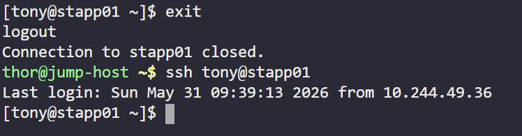
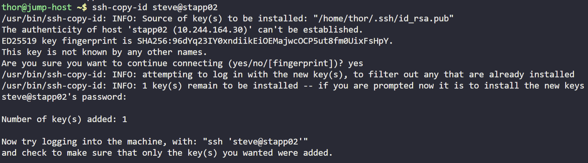
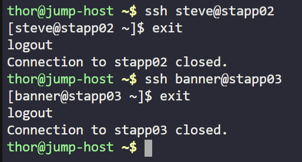

# Day 7 — Linux SSH Authentication

**Date:** 2026-05-31 | **Duration:** ~0.2h | **Status:** ✅ Complete

---

## 🎯 Objective

Set up password-less SSH authentication from the thor user on the jump host to all app servers through their respective sudo users, enabling automated scripts to run without requiring password input.

---

## 📋 Problem Statement

The system admins team of xFusionCorp Industries has set up scripts on the jump host that run at regular intervals and perform operations on all app servers in the Stratos Datacenter. These scripts need password-less SSH access from the thor user to all app servers through their respective sudo users (e.g., tony for app server 1) to function properly.

**Key Requirements:**
- Set up password-less authentication from user thor on jump host to all app servers
- Configure SSH key-based authentication for multiple app servers
- Enable automated script execution without manual password entry
- Verify connectivity and test across all app servers

---

## 📚 Prerequisites

- Access to jump host with thor user account
- SSH client installed on jump host
- Multiple app servers configured with respective sudo users
- Basic understanding of SSH and key-based authentication

---

## 💻 Step-by-Step Solution

### Step 1: check if there are any stored keys or not

**Description:**
Check if there are any stored keys or not

**Commands:**
```bash
ls -l .ssh/
```

**Expected Output:**
```
total 0
# If empty, no keys exist yet
```

---

### Step 2: Create new keys

**Description:**
Create new keys. Leave all entries blank (just hit enter). Now we have 2 keys (pub & priv)

**Commands:**
```bash
ssh-keygen -t rsa
# leave all entries blank (just hit enter)
```

**Expected Output:**
```
Generating public/private rsa key pair.
Enter file in which to save the key (/home/thor/.ssh/id_rsa): [Press Enter]
Enter passphrase (empty for no passphrase): [Press Enter]
Enter same passphrase again: [Press Enter]
Your identification has been saved in /home/thor/.ssh/id_rsa
Your public key has been saved in /home/thor/.ssh/id_rsa.pub
```

---

### Step 3: now lets connect to the first app server

**Description:**
Now lets connect to the first app server

**Commands:**
```bash
ssh <user>@<hostname>
```

**Expected Output:**
```
The authenticity of host 'app-server-1 (IP)' can't be established.
# Accept the fingerprint and enter password when prompted
```

---

### Step 4: from a second terminal from the jump host copy the pub key

**Description:**
From a second terminal from the jump host copy the pub key

**Commands:**
```bash
cat .ssh/id_rsa.pub
```

**Expected Output:**
```
ssh-rsa AAAAB3NzaC1yc2EAAAADAQABAAABgQC... [full public key content]
```

---

### Step 5: create a ssh folder in the user home dir

**Description:**
Create a ssh folder in the user home dir. Create the .ssh directory in the user's home folder and add the public key to the authorized_keys file.

**Commands:**
```bash
mkdir .ssh
cat > .ssh/authorised_keys
# Paste the key here
```

**Expected Output:**
```
# authorized_keys file created with public key content
```

---

### Step 6: lets test by exiting from terminal one and try to connect to app server 1 again

**Description:**
Lets test by exiting from terminal one and try to connect to app server 1 again. It should enter without asking for password as you can see here

**Commands:**
```bash
exit
ssh <user>@<hostname>
```

**Expected Output:**
```
# Should connect directly without password prompt
# You are now logged in to the app server
```

**Screenshot:**


---

### Step 7: for applying the same actions to the rest of web servers there is a trick command

**Description:**
For applying the same actions to the rest of web servers there is a trick command

**Commands:**
```bash
ssh-copy-id <user>@<hostname>
```

**Expected Output:**
```
/usr/bin/ssh-copy-id: INFO: Source of key(s) to be installed: "/home/thor/.ssh/id_rsa.pub"
Number of key(s) added: 1
# Similar output for each server
```

**Screenshot:**


---

### Step 8: Check the left users on the other app servers

**Description:**
Check the left users on the other app servers

**Commands:**
```bash
ssh <user>@<hostname>
cat .ssh/authorised_keys
exit
```

**Expected Output:**
```
# Public key should be visible in authorized_keys file
ssh-rsa AAAAB3NzaC1yc2EAAAADA... [your public key]
```

**Screenshot:**


---

## ✅ Verification

**How to verify the solution is correct:**
- [ ] SSH keys are generated successfully on jump host
- [ ] Public key is copied to all app servers' authorized_keys files
- [ ] Can SSH to all app servers without entering a password
- [ ] SSH connections are established via key-based authentication
- [ ] All sudo users (tony, etc.) on app servers accept the key
- [ ] Automated scripts can now execute without manual intervention

**Verification Command:**
```bash
# Test each app server
ssh tony@app-server-1 "echo 'SSH Access Verified'"
ssh tony@app-server-2 "echo 'SSH Access Verified'"
ssh tony@app-server-3 "echo 'SSH Access Verified'"
```

**Final Screenshot (Evidence of Completion):**


---

## 📊 Results & Evidence

| Item | Details |
|------|---------|
| **Status** | ✅ Success |
| **Time Taken** | ~0.2h |
| **Key Output** | Password-less SSH authentication established on all app servers |
| **Challenges** | Ensured consistent key deployment across multiple servers using ssh-copy-id |

---

## 🔑 Key Concepts Learned

1. **SSH Key Pair Generation** — Understanding how RSA key pairs work and their role in password-less authentication
2. **Public Key Infrastructure (PKI)** — Learning how public and private keys enable secure authentication without password transmission
3. **Authorized Keys Configuration** — Understanding how the .ssh/authorized_keys file controls SSH access on remote systems
4. **SSH-Copy-ID Utility** — Using built-in tools to efficiently distribute public keys to multiple servers
5. **Key-Based Authentication** — Implementing and verifying secure access mechanisms for automated scripts

---

## ⚠️ Common Mistakes & Troubleshooting

### Issue 1: Permission Denied (publickey)
**Cause:** Public key is not properly added to authorized_keys, or file permissions are incorrect
**Solution:** Verify the key is in authorized_keys and set proper permissions

```bash
# Check file contents
cat .ssh/authorized_keys

# Fix permissions
chmod 700 .ssh
chmod 600 .ssh/authorized_keys
```

### Issue 2: SSH Key Permission Issues
**Cause:** Private key has incorrect permissions (too open)
**Solution:** Restrict private key permissions

```bash
chmod 600 ~/.ssh/id_rsa
chmod 644 ~/.ssh/id_rsa.pub
```

### Issue 3: SSH-Copy-ID Command Not Found
**Cause:** openssh-client package not installed
**Solution:** Install openssh-client or use manual key copying method

```bash
sudo apt-get install openssh-client  # For Debian/Ubuntu
sudo yum install openssh-clients     # For CentOS/RHEL
```

### Issue 4: Still Prompting for Password After Setup
**Cause:** SSH is still attempting password authentication first
**Solution:** Verify key-based auth is enabled and keys are correctly placed

```bash
# Check SSH server config allows public key authentication
grep PubkeyAuthentication /etc/ssh/sshd_config
```

---

## 📌 Key Takeaways

- **What worked well:** Using ssh-copy-id dramatically reduced the time and complexity of setting up password-less authentication across multiple servers
- **What was challenging:** Ensuring correct file permissions and directory structure on remote servers
- **Next steps:** Configure SSH config file for easy host aliases and explore SSH agent for additional security features

---

## 🔗 Resources & References

- [SSH Key-Based Authentication Guide](https://www.digitalocean.com/community/tutorials/how-to-configure-ssh-key-based-authentication-on-a-linux-server)
- [SSH Protocol Documentation](https://man.openbsd.org/ssh)
- [Authorized Keys Configuration](https://man.openbsd.org/sshd#AUTHORIZED_KEYS_FILE_FORMAT)

---

## 📁 Files & Configurations

### Files Created/Modified:
- `~/.ssh/id_rsa` — Private key (must be kept secure)
- `~/.ssh/id_rsa.pub` — Public key (distributed to servers)
- `~/.ssh/authorized_keys` — Public keys allowed for authentication on each app server

### File Permissions:
```bash
# Correct permissions for SSH configuration
.ssh directory: 700 (drwx------)
id_rsa (private key): 600 (-rw-------)
id_rsa.pub (public key): 644 (-rw-r--r--)
authorized_keys: 600 (-rw-------)
```

---

## 🏷️ Tags

`ssh` `authentication` `linux` `key-based` `security` `automation` `devops` `jump-host` `remote-access`

---

## 📝 Notes

- Store private key securely; never share it with others
- Consider using SSH agent to manage keys without entering passphrase
- Document which users have SSH access to which servers for audit purposes
- Regularly review authorized_keys files to remove unused keys
- Consider key rotation policies for enhanced security
- Use SSH config file (~/.ssh/config) for easier host management

---

**Challenge Completed:** ✅ YES  
**Difficulty Level:** ⭐⭐ (1-5 stars)  
**Time Investment:** Worth it ✅
