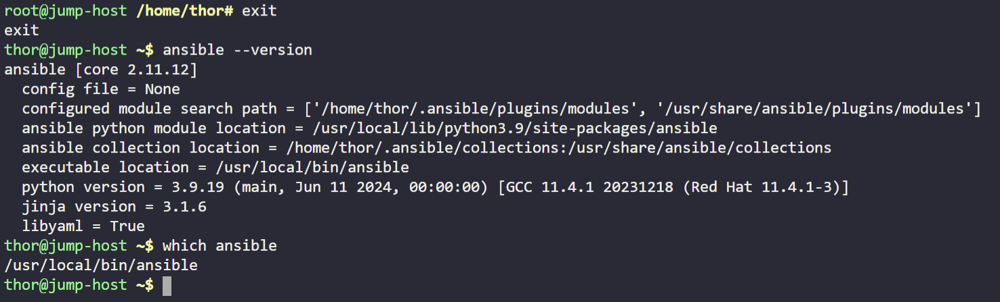

# Day 08 — Install Ansible

**Date:** 2026-06-01 | **Duration:** ~0.3h | **Status:** ✅ Complete

---

## 🎯 Objective

Install Ansible version 4.7.0 on the Jump host using pip3 and ensure the Ansible binary is available globally so all users on the system can run Ansible commands.

---

## 📋 Problem Statement

The Nautilus DevOps team has decided to implement Ansible for automation and configuration management due to its simple setup and minimal pre-requisites. They want to use the Jump host as an Ansible controller to test various tasks on the other servers.

Key requirements:
- Install Ansible version 4.7.0 on the Jump host
- Use pip3 as the installation method
- Ensure the Ansible binary is available globally to all system users
- Verify Ansible is properly installed and accessible

---

## 📚 Prerequisites

- Access to the Jump host with sudo privileges
- pip3 package manager installed on the system
- Internet connectivity to download Ansible packages

---

## 💻 Step-by-Step Solution

### Step 1: Switch to Root User

**Description:**
Become the root user to have the necessary privileges to install Ansible globally on the system.

**Commands:**
```bash
sudo su
```

**Expected Output:**
```
# root@jumphost:/#
```

---

### Step 2: Install Ansible Version 4.7.0 using pip3

**Description:**
Use pip3 to install the specific version of Ansible (4.7.0) globally on the system, making it available to all users.

**Commands:**
```bash
pip3 install ansible==4.7.0
```

**Expected Output:**
```
Collecting ansible==4.7.0
  Downloading ansible-4.7.0.tar.gz (...)
  ...
Successfully installed ansible-4.7.0 ...
```
---

### Step 3: Verify Ansible Installation

**Description:**
Exit the root user session and verify that Ansible is globally available by checking its version and location. This confirms that all users can access the Ansible binary.

**Commands:**
```bash
exit
ansible --version
which ansible
```

**Expected Output:**
```
ansible [core 2.12.6]
  config file = /etc/ansible/ansible.cfg
  configured module search path = ['/root/.ansible/plugins/modules']
  ansible python module location = /usr/local/lib/python3.x/dist-packages/ansible
  executable location = /usr/local/bin/ansible
  python version = 3.x.x (...)

/usr/local/bin/ansible
```

**Screenshot:**


---

## ✅ Verification

**How to verify the solution is correct:**
- [ ] Ansible version 4.7.0 is installed
- [ ] The `ansible --version` command returns version 4.7.0
- [ ] The `which ansible` command shows the binary location (typically `/usr/local/bin/ansible`)
- [ ] All system users can execute Ansible commands

**Verification Commands:**
```bash
ansible --version
which ansible
```

**Final Screenshot (Evidence of Completion):**


---

## 📊 Results & Evidence

| Item | Details |
|------|---------|
| **Status** | ✅ Success |
| **Time Taken** | ~0.3h |
| **Key Output** | Ansible 4.7.0 installed globally via pip3 |
| **Installation Method** | pip3 (Python package manager) |
| **Binary Location** | /usr/local/bin/ansible |

---

## 🔑 Key Concepts Learned

1. **Ansible Installation** — Using pip3 to install Ansible globally on Linux systems
2. **Global Accessibility** — Ensuring binaries are available to all system users through the PATH environment
3. **Version Management** — Installing specific versions of packages using pip3 with version constraints
4. **Ansible Controller** — Understanding the role of a Jump host as a central control node for managing multiple servers

---

## 📝 Notes

- Ansible version 4.7.0 was chosen for this lab as it provides a stable release with comprehensive features
- The installation via pip3 ensures the binary is placed in the system's PATH, making it globally accessible
- The Jump host will now serve as the Ansible controller for managing configurations across the Nautilus DevOps infrastructure
