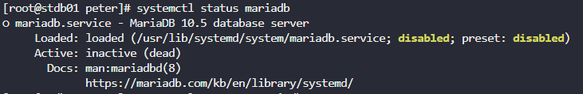
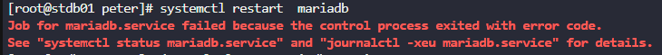
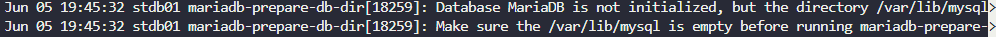
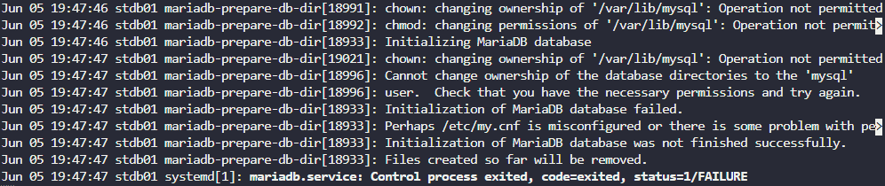
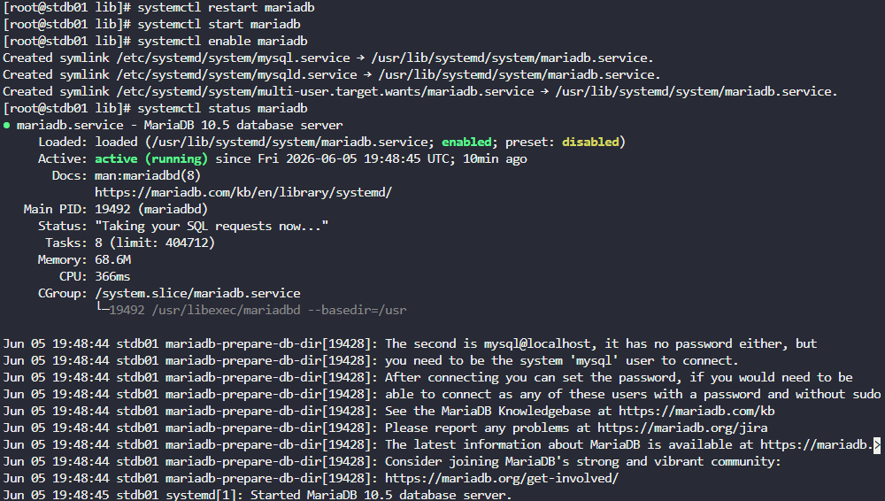

# Day 09 — MariaDB Troubleshooting

**Date:** 2026-06-05 | **Duration:** ~0.3h | **Status:** ✅ Complete

---

## 🎯 Objective

Troubleshoot and restore the MariaDB service on the database server by addressing initialization issues, permission problems, and service configuration to restore database connectivity.

---

## 📋 Problem Statement

The Nautilus application in Stratos DC is unable to connect to the database. The production support team has identified that the MariaDB service is down on the database server due to initialization and permission issues.

Key requirements:
- Check the MariaDB service status
- Identify the root cause of the service failure
- Create the required MySQL data directory
- Fix permission issues with the MySQL data directory
- Restart and enable the MariaDB service
- Verify successful service restoration

---

## 📚 Prerequisites

- Access to the database server with sufficient privileges (sudo/root)
- SSH access to the database server
- Basic understanding of Linux systemctl commands
- Knowledge of file permissions (chown, chmod)
- Familiarity with systemd logging (journalctl)

---

## 💻 Step-by-Step Solution

### Step 1: SSH to the Database Server

**Description:**
Connect to the database server using the challenge-provided SSH credentials.

**Commands:**
```bash
ssh <user>@<hostname>
sudo su
```

**Expected Output:**
```
[root@stdb01 ~]#
```

---

### Step 2: Check the MariaDB Service Status

**Description:**
Verify that the MariaDB service is currently down and check its current state.

**Commands:**
```bash
systemctl status mariadb
```

**Expected Output:**
```
● mariadb.service - MariaDB 10.x Database Server
   Loaded: loaded (/usr/lib/systemd/system/mariadb.service; disabled; ...)
   Active: inactive (dead)
```

**Key Finding:** The service is disabled and not running.

**Screenshot:**



---

### Step 3: Attempt to Restart the Service (Initial Failure)

**Description:**
Try restarting the MariaDB service to identify the specific error.

**Commands:**
```bash
systemctl restart mariadb
```

**Expected Output:**
```
Job for mariadb.service failed because the control process exited with error code.
```

**Key Finding:** An error code indicates the service cannot start properly.

**Screenshot:**



---

### Step 4: Check Service Logs for Root Cause

**Description:**
Examine the systemd journal logs to identify why the service is failing to start.

**Commands:**
```bash
journalctl -xeu mariadb.service
```

**Expected Output:**
```
[error] InnoDB: Unable to lock ./ibdata1, error: 11
[error] Plugin 'InnoDB' init function returned error.
mkdir: cannot create directory '/var/lib/mysql': No such file or directory
```

**Key Finding:** The `/var/lib/mysql` directory does not exist, which is required for MariaDB initialization.

**Screenshot:**



---

### Step 5: Verify the Missing Directory

**Description:**
Confirm that the required MySQL data directory is missing.

**Commands:**
```bash
ls -l /var/lib/mysql
```

**Expected Output:**
```
ls: cannot access '/var/lib/mysql': No such file or directory
```

---

### Step 6: Create the Required MySQL Data Directory

**Description:**
Create the missing `/var/lib/mysql` directory that MariaDB needs for its data files.

**Commands:**
```bash
mkdir -p /var/lib/mysql
```

Or alternatively:
```bash
cd /var/lib
mkdir mysql
```

**Expected Output:**
```
[No output on success]
```

---

### Step 7: Fix Directory Permissions

**Description:**
The directory is now owned by root, but MariaDB runs as the mysql user. Change ownership to the mysql user and group to resolve permission issues.

**Note:** If you try to start the service before fixing permissions, you will encounter a permissions error.

**Screenshot (Permission Error Before Fix):**



**Commands:**
```bash
chown -R mysql:mysql /var/lib/mysql
```

**Expected Output:**
```
[No output on success]
```

**Verification:**
```bash
ls -ld /var/lib/mysql
```

**Expected Output:**
```
drwxr-xr-x. 2 mysql mysql 6 Jun  5 12:00 /var/lib/mysql
```

---

### Step 8: Restart the MariaDB Service

**Description:**
Now that the directory exists with proper permissions, restart the MariaDB service.

**Commands:**
```bash
systemctl restart mariadb
```

Or use individual commands:
```bash
systemctl start mariadb
systemctl enable mariadb
```

**Expected Output:**
```
[No output on success]
```

---

### Step 9: Verify Service Status

**Description:**
Confirm that the MariaDB service is now running and enabled.

**Commands:**
```bash
systemctl status mariadb
```

**Expected Output:**
```
● mariadb.service - MariaDB 10.x Database Server
   Loaded: loaded (/usr/lib/systemd/system/mariadb.service; enabled; vendor preset: disabled)
   Active: active (running) since Thu 2026-06-05 12:00:00 UTC; 2s ago
   ...
   Jun 05 12:00:00 stdb01 systemd[1]: Started MariaDB 10.x Database Server.
```

**Key Finding:** Service is now active (running) and enabled for automatic startup.

**Screenshot:**



---

## 🔑 Key Concepts

| Concept | Description |
|---------|-------------|
| **systemctl** | Linux tool to manage systemd services |
| **journalctl** | Command to view systemd journal logs |
| **chown** | Change file/directory ownership |
| **mkdir -p** | Create directory and parent directories if needed |
| **/var/lib/mysql** | Default data directory for MariaDB |
| **mysql:mysql** | MariaDB service user and group |

---

## 📝 Summary

The MariaDB service was failing to start due to a missing `/var/lib/mysql` directory and subsequent permission issues. The solution involved:

1. ✅ Identifying the service was down using `systemctl status`
2. ✅ Checking logs with `journalctl` to find the root cause
3. ✅ Creating the missing directory structure
4. ✅ Correcting permissions with `chown`
5. ✅ Restarting and enabling the service
6. ✅ Verifying successful restoration

The Nautilus application can now reconnect to the database successfully.

---

## 🎓 Learning Outcomes

- Troubleshooting failed systemd services using `journalctl`
- Understanding file and directory permissions in Linux
- Managing MariaDB/MySQL data directories
- Using `chown` to fix ownership issues
- Service lifecycle management with `systemctl`
