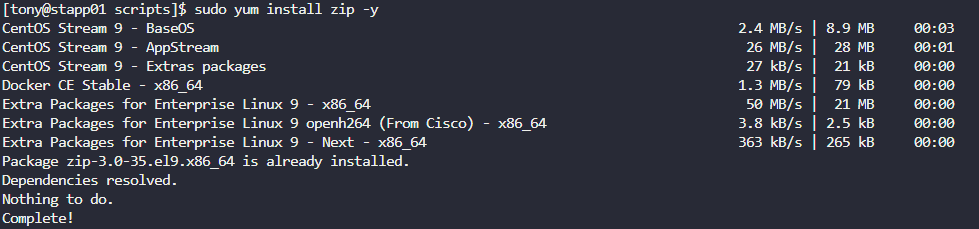
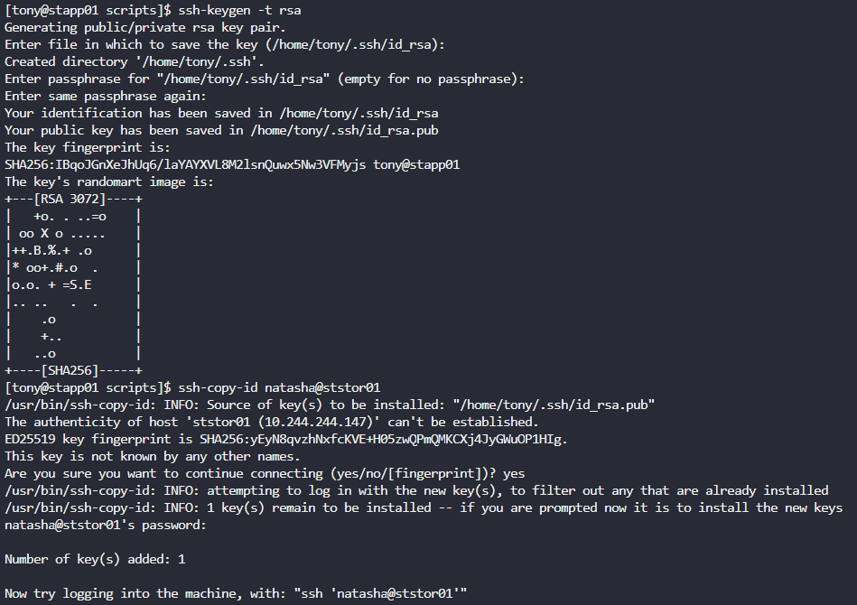
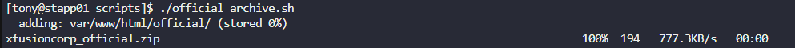
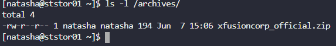

# Day 10 — Linux Bash Scripts & SSH Automation

**Date:** 2026-06-07 | **Duration:** ~0.5h | **Status:** ✅ Complete

---

## 🎯 Objective

Create a bash script named `official_archive.sh` to automate the archiving and replication of website content files from App Server 1 to the Nautilus Storage Server using SSH authentication without password prompts.

---

## 📋 Problem Statement

The production support team at xFusionCorp Industries needs to automate the archiving of static website content. They require:
- A bash script that creates a zip archive of the `/var/www/html/official` directory
- Archive storage in `/archives/` on App Server 1
- Automated copying of the archive to the Nautilus Storage Server
- Password-less SSH authentication for automated execution
- Script must be executable by the respective server user without `sudo`

Key requirements:
- Script location: `/scripts/official_archive.sh`
- Archive name: `xfusioncorp_official.zip`
- Source directory: `/var/www/html/official`
- Destination on storage server: `/archives/`
- No password prompts during execution
- Install `zip` package manually before running the script

---

## 📚 Prerequisites

- SSH access to App Server 1 (`stapp01`)
- SSH access to Nautilus Storage Server (`ststor01`)
- Ability to escalate to root with `sudo su`
- Knowledge of bash scripting and SSH key-based authentication
- Understanding of `zip`, `scp`, and SSH key generation

---

## 💻 Step-by-Step Solution

### Step 1: Log into App Server 1 (stapp01)

**Description:**
Connect to App Server 1 using SSH with the challenge-provided credentials.

**Commands:**
```bash
ssh <username>@stapp01
```

**Expected Output:**
```
# direct shell on stapp01
```

---

### Step 2: Install the `zip` package

**Description:**
Install the `zip` package on App Server 1 using `yum`. This package is required to create zip archives from directories.

**Commands:**
```bash
sudo yum install zip -y
```

**Expected Output:**
```
# Package installation confirmation
Installed:
  zip.x86_64 0:3.0-11.el7
```

**Screenshot:**


---

### Step 3: Set up SSH Key-Based Authentication

**Description:**
Generate an RSA SSH key pair and copy the public key to the Nautilus Storage Server to enable password-less authentication. This allows the script to copy the archive without prompting for a password.

**Commands:**
```bash
ssh-keygen -t rsa
ssh-copy-id <storage_server_user>@ststor01
```

**Expected Output:**
```
Generating public/private rsa key pair.
# Follow prompts to save key and set passphrase (or leave empty for no passphrase)

# After ssh-copy-id:
Number of key(s) added: 1
```

**Screenshot:**


---

### Step 4: Create the `official_archive.sh` Script

**Description:**
Navigate to the `/scripts/` directory and create the bash script. The script performs two tasks:
1. Creates a zip archive of `/var/www/html/official` in `/archives/`
2. Copies the archive to the Nautilus Storage Server using `scp`

**Commands:**
```bash
cd /scripts/
vi official_archive.sh
```

**Script Content:**
```bash
#!/bin/bash
zip /archives/xfusioncorp_official.zip /var/www/html/official
scp /archives/xfusioncorp_official.zip natasha@ststor01:/archives
```

**To save and exit in vi:**
- Press `Esc` to enter command mode
- Type `:wq` and press `Enter` to save and exit

**Expected Output:**
```
# Script file created successfully
```

---

### Step 5: Make the Script Executable

**Description:**
Add execute permissions to the `official_archive.sh` script so it can be run as an executable file.

**Commands:**
```bash
chmod +x official_archive.sh
```

**Expected Output:**
```
# No output on success, script permissions updated
```

---

### Step 6: Execute the Script and Verify Archive Creation

**Description:**
Run the script from the `/scripts/` directory. The script will create the zip archive and copy it to the storage server.

**Commands:**
```bash
./official_archive.sh
```

**Expected Output:**
```
# zip compression messages
# scp transfer confirmation
```

**Screenshot:**


---

### Step 7: Verify Archive on Nautilus Storage Server

**Description:**
SSH to the Nautilus Storage Server and verify the archive has been successfully copied to `/archives/`.

**Commands:**
```bash
ssh natasha@ststor01
ls -l /archives/
```

**Expected Output:**
```
total XX
-rw-r--r-- 1 natasha natasha XXXXX Jun  7 HH:MM xfusioncorp_official.zip
```

**Screenshot:**


---

## ✅ Verification

**How to verify the solution is correct:**
- [ ] `zip` package is installed on App Server 1
- [ ] SSH key-based authentication is configured (no password required)
- [ ] `official_archive.sh` exists in `/scripts/` directory
- [ ] Script has executable permissions (`chmod +x`)
- [ ] Script executes without errors
- [ ] Archive file `xfusioncorp_official.zip` exists in `/archives/` on App Server 1
- [ ] Archive is successfully copied to `/archives/` on Nautilus Storage Server
- [ ] Verify with `ls -l /archives/` on storage server

**Verification Commands:**
```bash
# On App Server 1
ls -l /scripts/official_archive.sh
ls -l /archives/xfusioncorp_official.zip

# On Nautilus Storage Server
ssh natasha@ststor01 "ls -l /archives/xfusioncorp_official.zip"
```

**Final Screenshot (Evidence of Completion):**


---

## 📊 Results & Evidence

| Item | Details |
|------|---------|
| **Status** | ✅ Success |
| **Time Taken** | ~0.5h |
| **Script Name** | official_archive.sh |
| **Script Location** | /scripts/official_archive.sh |
| **Archive Name** | xfusioncorp_official.zip |
| **Source Directory** | /var/www/html/official |
| **Archive Storage** | /archives/ on both stapp01 and ststor01 |
| **Authentication Method** | SSH key-based (password-less) |
| **Server User** | natasha (or respective app server user) |

---

## 🎓 Key Learnings

1. **Bash Script Automation** — Creating executable bash scripts to automate repetitive system administration tasks
2. **SSH Key-Based Authentication** — Using `ssh-keygen` and `ssh-copy-id` to enable password-less SSH access between servers
3. **File Compression and Transfer** — Using `zip` for archiving and `scp` for secure file transfer
4. **Script Execution Permissions** — Setting proper permissions with `chmod +x` to make scripts executable
5. **Cross-Server Communication** — Automating data replication between application and storage servers

---

## ⚠️ Common Mistakes & Troubleshooting

### Issue 1: `zip: command not found`
**Cause:** The `zip` package is not installed on App Server 1
**Solution:** Install the zip package before running the script

```bash
sudo yum install zip -y
```

### Issue 2: `scp` asks for password during script execution
**Cause:** SSH key-based authentication is not configured
**Solution:** Generate SSH keys and copy the public key to the storage server

```bash
ssh-keygen -t rsa
ssh-copy-id natasha@ststor01
```

### Issue 3: `Permission denied` when running the script
**Cause:** Script does not have executable permissions
**Solution:** Add executable permission to the script

```bash
chmod +x /scripts/official_archive.sh
```

### Issue 4: Script runs but archive is not found on storage server
**Cause:** Incorrect username or hostname in the `scp` command
**Solution:** Verify the username and hostname in the script match the storage server credentials

```bash
# Correct format in script:
scp /archives/xfusioncorp_official.zip natasha@ststor01:/archives
```

---

## 📌 Key Takeaways

- **What worked well:** SSH key generation and authentication setup enabled password-less script execution; zip archive creation and transfer completed seamlessly
- **What was challenging:** Ensuring SSH key permissions and authentication were properly configured before script execution
- **Best practices:** Always verify cross-server communication and file transfer before running production scripts; test scripts in stages rather than all at once

---

## 🔗 Resources & References

- [Linux `zip` command documentation](https://linux.die.net/man/1/zip)
- [SSH key generation guide](https://man7.org/linux/man-pages/man1/ssh-keygen.1.html)
- [SCP (Secure Copy Protocol) documentation](https://man7.org/linux/man-pages/man1/scp.1.html)
- [Bash scripting basics](https://www.gnu.org/software/bash/manual/bash.html)
- [Linux permissions and `chmod`](https://man7.org/linux/man-pages/man1/chmod.1.html)

---

## 📁 Files & Configurations

### Files Created/Modified:
- `/scripts/official_archive.sh` — Bash script for archiving and transferring website content
- `README.md` — Day 10 challenge documentation and solution summary

### Key Commands Reference:
```bash
# Installation
sudo yum install zip -y

# SSH Key Setup
ssh-keygen -t rsa
ssh-copy-id natasha@ststor01

# Script Creation and Execution
vi /scripts/official_archive.sh
chmod +x /scripts/official_archive.sh
/scripts/official_archive.sh

# Verification
ls -l /archives/xfusioncorp_official.zip
ssh natasha@ststor01 "ls -l /archives/"
```

---

**Challenge Completed Successfully!** ✅
