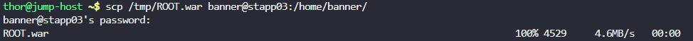
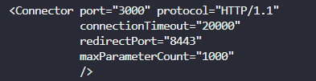
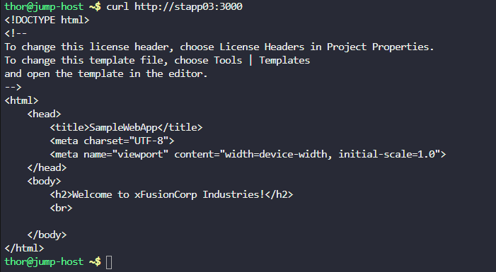

# Day 11 — Install Tomcat Server

**Date:** 2026-06-08 | **Duration:** ~0.2h | **Status:** ✅ Complete

---

## 🎯 Objective

Install and configure Apache Tomcat server on App Server 3 to deploy a Java-based web application on a custom port.

---

## 📋 Problem Statement

The Nautilus application development team has completed the beta version of their Java-based application and plans to deploy it on one of the app servers in Stratos DC. They have decided to use Tomcat as the application server.

Key requirements:
- Install Tomcat server on App Server 3 (`stapp03`)
- Configure Tomcat to run on port 3000 (instead of the default port 8080)
- Deploy a `ROOT.war` file (available on Jump Host at `/tmp`)
- Ensure the web application is accessible via `curl http://stapp03:3000`

---

## 📚 Prerequisites

- SSH access to App Server 3 (`stapp03`)
- SSH access to Jump Host to retrieve the `ROOT.war` file
- Ability to escalate to root with `sudo su`
- `yum` package manager available
- Basic knowledge of file transfer (scp) and service management (systemctl)
- Access to text editor (vi/vim) for configuration

---

## 💻 Step-by-Step Solution

### Step 1: Copy ROOT.war from Jump Host to App Server 3

**Description:**
Transfer the web application WAR file from the Jump Host to App Server 3 using secure copy.

**Commands:**
```bash
scp /tmp/ROOT.war banner@stapp03:/home/banner
```

**Expected Output:**
```
ROOT.war    100%  [Archive file copied successfully]
```

**Step 1 Screenshot (SCP File Transfer):**



---

### Step 2: SSH to App Server 3

**Description:**
Establish SSH connection to App Server 3 and escalate privileges to root.

**Commands:**
```bash
ssh banner@stapp03
sudo su
```

**Expected Output:**
```
[root@stapp03 banner]#
```

---

### Step 3: Update System and Install Tomcat

**Description:**
Update the system packages and install Apache Tomcat server.

**Commands:**
```bash
yum update -y && yum install tomcat -y
```

**Expected Output:**
```
Complete!
Installed:
  tomcat.noarch 0:7.0.76-16.el7_9
```

---

### Step 4: Move ROOT.war to Tomcat Webapps Directory

**Description:**
Move the copied ROOT.war file to the Tomcat webapps directory where applications are deployed.

**Commands:**
```bash
mv /home/banner/ROOT.war /usr/share/tomcat/webapps/
```

**Expected Output:**
```
[No output indicates success]
```

---

### Step 5: Update Tomcat Port Configuration

**Description:**
Edit the Tomcat server configuration to change the port from the default 8080 to 3000.

**Commands:**
```bash
vi /etc/tomcat/server.xml
```

**Actions:**
1. Search for the default port configuration (line with port 8080)
2. Change `8080` to `3000`
3. Save and exit: `Esc` → `:wq` → `Enter`

**Configuration Location:**
```xml
<Connector port="3000" protocol="HTTP/1.1"
           connectionTimeout="20000"
           redirectPort="8443" />
```

**Step 5 Screenshot (Configuration Change):**



---

### Step 6: Start/Restart Tomcat Service

**Description:**
Restart the Tomcat service to apply the configuration changes and deploy the application.

**Commands:**
```bash
systemctl restart tomcat
```

**Expected Output:**
```
[No output indicates successful restart]
```

---

### Step 7: Verify Web Application Deployment

**Description:**
Exit to Jump Host and verify that the web application is accessible on the configured port.

**Commands:**
```bash
exit
exit
curl http://stapp03:3000
```

**Expected Output:**
The application webpage should be displayed in the browser or curl output.

**Step 7 Screenshot (Verification):**



---

## ✅ Verification Checklist

- [x] ROOT.war successfully copied to App Server 3
- [x] Tomcat server installed
- [x] ROOT.war moved to `/usr/share/tomcat/webapps/`
- [x] Port configuration updated from 8080 to 3000
- [x] Tomcat service restarted
- [x] Application accessible at `http://stapp03:3000`

---

## 🔑 Key Learnings

1. **Tomcat Installation**: Apache Tomcat is installed via the `yum` package manager on RHEL-based systems
2. **WAR Deployment**: Web Application Archive (WAR) files are deployed by placing them in the `webapps` directory
3. **Port Configuration**: Tomcat's port is configured in `/etc/tomcat/server.xml` using the `<Connector>` element
4. **Service Management**: `systemctl` is used to manage Tomcat service lifecycle (start, stop, restart)
5. **File Transfer**: `scp` is used for secure file transfer between hosts in SSH-based deployments

---

## 📝 Notes

- The ROOT.war file becomes the default application when deployed to the webapps folder
- Tomcat must be restarted after configuration changes to apply them
- Ensure sufficient disk space is available in `/usr/share/tomcat/` for application deployment
- Check Tomcat logs at `/var/log/tomcat/` if deployment issues occur
