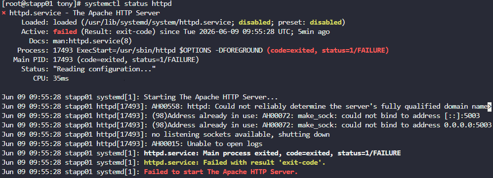
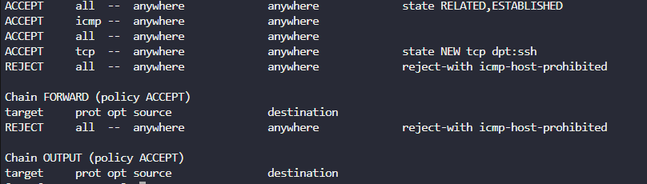

# Day 12 — Linux Network Services Troubleshooting

**Date:** 2026-06-09 | **Duration:** ~0.5h | **Status:** ✅ Complete

---

## 🎯 Objective

Diagnose and resolve network connectivity issues with the Apache web server running on port 5003 in the Stratos Datacenter. Use network diagnostic tools to identify port conflicts and firewall restrictions, then apply fixes to restore reachability.

---

## 📋 Problem Statement

The monitoring tool has reported that one of the app servers (stapp01) is unreachable on port 5003, where the Apache service should be listening. The issue could be caused by:
- Apache service being down
- Another service occupying port 5003
- Firewall rules blocking access
- Network configuration issues

Key requirements:
- Identify which app server has the issue
- Use diagnostic tools (telnet, netstat, curl) to troubleshoot
- Resolve port conflicts
- Configure firewall rules to allow access
- Verify Apache is reachable from the jump host
- Test using: `curl http://stapp03:5003`

---

## 📚 Prerequisites

- SSH access to app servers (stapp01, stapp02, stapp03)
- Ability to escalate to root with `sudo su`
- Knowledge of network diagnostic tools:
  - `curl` — HTTP client for testing connectivity
  - `telnet` — Check port connectivity
  - `netstat` — View network connections and listening ports
  - `iptables` — Manage firewall rules
  - `systemctl` — Manage services
- Understanding of firewall rules and port conflicts

---

## 💻 Step-by-Step Solution

### Step 1: Identify which server has the issue

**Description:**
Test connectivity to each app server on port 5003 to identify which one is unreachable.

**Commands:**
```bash
curl http://stapp01:5003
curl http://stapp02:5003
curl http://stapp03:5003
```

**Expected Output:**
```
# stapp01: Connection refused or no response
# stapp02: HTML response (working)
# stapp03: HTML response (working)
```

**Screenshot:**


---

### Step 2: SSH to the problematic server

**Description:**
Connect to the server that is not responding and escalate to root privileges to begin troubleshooting.

**Commands:**
```bash
ssh <username>@stapp01
sudo su
```

**Expected Output:**
```
# root prompt, e.g. root@stapp01:/#
```

**Screenshot:**


---

### Step 3: Check the Apache (httpd) service status and identify port conflicts

**Description:**
Verify whether the Apache service is running. It should show as inactive. Then use `netstat` to determine which service is currently using port 5003.

**Commands:**
```bash
systemctl status httpd
```

**Expected Output:**
```
● httpd.service - The Apache HTTP Server
   Loaded: loaded (/usr/lib/systemd/system/httpd.service; enabled; vendor preset: disabled)
   Active: inactive (dead) since ...
```

**Screenshot:**


**Next, check which service is using port 5003:**

```bash
# Install net-tools if needed
yum install net-tools -y

# Check listening ports
netstat -tunlp
```

**Expected Output:**
```
Proto Recv-Q Send-Q Local Address           Foreign Address         State       PID/Program name
tcp        0      0 0.0.0.0:5003            0.0.0.0:*               LISTEN      1234/sendmail
...
```

**Key Finding:**
Port 5003 is occupied by the `sendmail` service, not Apache.

---

### Step 4: Reconfigure sendmail to use a different port

**Description:**
Modify the sendmail configuration file to use a different port (e.g., 28) instead of port 5003, freeing up the port for Apache.

**Commands:**
```bash
cd /etc/mail
vi sendmail.cf
```

**Inside the editor:**
- Search for the line containing `5003`: `/5003`
- Change the port from 5003 to 28 (or another available port)
- Save and exit: `Esc` → `:wq` → `Enter`

**Screenshot:**


---

### Step 5: Restart the sendmail service

**Description:**
Restart the sendmail service to apply the configuration changes.

**Commands:**
```bash
systemctl restart sendmail
```

**Expected Output:**
```
# No output indicates success
```

---

### Step 6: Test connectivity from jump host (should still fail initially)

**Description:**
Try accessing Apache from the jump host again. It may still fail because firewall rules may be blocking the connection.

**Commands:**
```bash
curl http://stapp01:5003
```

**Expected Output:**
```
curl: (7) Failed to connect to stapp01 port 5003: No route to host
# or connection timeout
```

---

### Step 7: Check firewall rules and add access for jump host

**Description:**
Review the current iptables firewall rules and add a rule to allow the jump host to access port 5003 on stapp01.

**Commands:**
```bash
iptables -L
```

**Expected Output:**
```
Chain INPUT (policy ACCEPT)
target     prot opt source               destination
...
```

**Screenshot:**


---

## ✅ Verification

**How to verify the solution is correct:**
- [ ] All three app servers respond to `curl http://stapp0X:5003`
- [ ] Sendmail is running on a different port (28)
- [ ] Port 5003 is now listening for Apache
- [ ] Firewall rules allow jump host to access port 5003
- [ ] curl returns the Apache welcome page HTML from jump host

**Verification Commands (from jump host):**
```bash
curl http://stapp01:5003
curl http://stapp02:5003
curl http://stapp03:5003
```

**Verification Commands (on stapp01):**
```bash
systemctl status httpd
netstat -tunlp | grep 5003
iptables -L | grep 5003
```

**Final Screenshot (Evidence of Completion):**


---

## 📊 Results & Evidence

| Item | Details |
|------|---------|
| **Status** | ✅ Success |
| **Time Taken** | ~0.5h |
| **Root Cause** | Sendmail using port 5003 |
| **Primary Fix** | Reconfigured sendmail to port 28 |
| **Secondary Fix** | Added firewall rule for jump host |
| **Server** | App Server 1 (stapp01) |
| **Port** | 5003 (Apache) |
| **Verification Method** | curl http://stapp01:5003 |

---

## 🎓 Key Learnings

- **Port Conflicts:** Always check which service is using a specific port before assuming the primary service is the issue using `netstat -tunlp`

- **Service Dependencies:** Some services may need to be reconfigured rather than stopped to preserve system functionality

- **Firewall Rules:** Use `iptables -I INPUT` to insert rules at the beginning of the chain for priority. The format is: `-p <protocol> -s <source-ip> --dport <destination-port> -j <action>`

- **Network Troubleshooting Workflow:**
  1. Test connectivity from client side (curl)
  2. Check service status (systemctl status)
  3. Verify port bindings (netstat)
  4. Check firewall rules (iptables -L)
  5. Review service configuration files
  6. Apply fixes and verify

- **Configuration Files:** Important service configs are usually in `/etc/` directory (e.g., `/etc/mail/sendmail.cf`)

- **Verification:** Always test fixes from the original source to confirm the issue is resolved (curl from jump host)

---

## 🔧 Troubleshooting Notes

| Issue | Solution |
|-------|----------|
| `netstat` command not found | `yum install net-tools -y` |
| `iptables` rules not persistent | Use `iptables-save` or configure firewalld for persistence |
| Apache still won't start | Check `/var/log/httpd/error_log` for detailed error messages |
| Sendmail won't restart | Verify syntax in `/etc/mail/sendmail.cf` and check `/var/log/maillog` |

