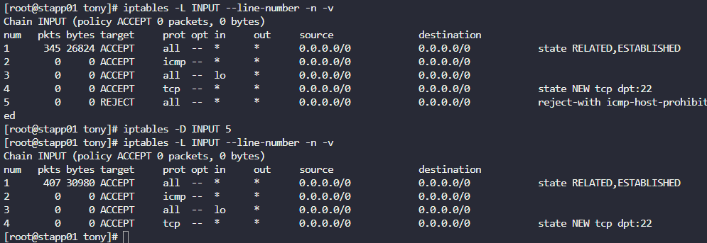

# Day 13 — IPTables Installation and Configuration

**Date:** 2026-06-14 | **Duration:** ~0.5h | **Status:** ✅ Complete

---

## 🎯 Objective

Install and configure IPTables firewall rules to block incoming port 5002 on all application servers for everyone except the Load Balancer (LBR) host, then persist the rules across system reboots.

---

## 📋 Problem Statement

The security team has identified that Apache's port 5002 is open to all hosts without any firewall protection on the Nautilus infrastructure in Stratos DC. To add a security layer, we need to:

**Key requirements:**
- Install iptables and all dependencies on each app host
- Block incoming port 5002 for everyone except the LBR host
- Ensure rules persist after system reboot
- Verify the configuration from jumphost and LBR host

**Target Servers:** stapp01, stapp02, stapp03

---

## 📚 Prerequisites

- SSH access to all app servers (stapp01, stapp02, stapp03) with root privileges
- SSH access to the Load Balancer (stlb01) for verification
- Access to jumphost for testing
- Knowledge of firewall rules and iptables syntax

---

## 💻 Step-by-Step Solution

### Step 1: SSH to Each App Server and Install IPTables

**Description:**
Connect to each application server and install iptables package along with its service dependencies.

**Commands:**
```bash
ssh <user>@stapp01
sudo su
yum install iptables -y
yum install iptables-services -y
```

**Expected Output:**
```
Loaded plugins: fastestmirror, security
Loading mirror speeds from cached hostfile
Resolving Dependencies
--> Running transaction check
...
Complete!
```

**Repeat for:** stapp02 and stapp03

---

### Step 2: Enable and Start IPTables Service

**Description:**
Enable the iptables service on each app server to start automatically on boot and start it immediately.

**Commands:**
```bash
systemctl enable iptables
systemctl start iptables
```

**Expected Output:**
```
# Service enabled and started successfully
```

**Repeat for:** stapp01, stapp02, and stapp03

---

### Step 3: Check Current IPTables Rules

**Description:**
List the current INPUT chain rules with line numbers. This helps identify the default REJECT ALL rule that needs to be removed before adding our custom rules.

**Commands:**
```bash
iptables -L INPUT --line-number -n -v
```

**Expected Output:**
```
Chain INPUT (policy ACCEPT 0 packets, 0 bytes)
num  target     prot opt in     out     source               destination
1    ACCEPT     all  --  *      *       0.0.0.0/0            0.0.0.0/0            state RELATED,ESTABLISHED
2    ACCEPT     all  --  lo     *       0.0.0.0/0            0.0.0.0/0
3    DROP       icmp --  *      *       0.0.0.0/0            0.0.0.0/0
4    ACCEPT     tcp  --  *      *       0.0.0.0/0            0.0.0.0/0            tcp dpt:22
5    REJECT     all  --  *      *       0.0.0.0/0            0.0.0.0/0            reject-with icmp-host-prohibited
```

**Screenshot (Step 3 only):**



**Repeat for:** stapp01, stapp02, and stapp03

---

### Step 4: Remove Default REJECT Rule

**Description:**
Delete the REJECT ALL rule (line 5) to allow us to add our custom rules.

**Commands:**
```bash
iptables -D INPUT 5
```

**Expected Output:**
```
# Rule deleted successfully (no output means success)
```

**Repeat for:** stapp01, stapp02, and stapp03

---

### Step 5: Add Firewall Rules for Port 5002

**Description:**
Add two rules to the INPUT chain:
1. ACCEPT incoming traffic on port 5002 from the LBR host (stlb01)
2. DROP all other incoming traffic on port 5002

**Commands:**
```bash
iptables -A INPUT -p tcp -s stlb01 --dport 5002 -j ACCEPT
iptables -A INPUT -p tcp --dport 5002 -j DROP
```

**Expected Output:**
```
# Rules added successfully (no output means success)
```

**Rule Explanation:**
- `-A INPUT` — Append to INPUT chain
- `-p tcp` — Protocol is TCP
- `-s stlb01` — Source is the LBR host
- `--dport 5002` — Destination port is 5002
- `-j ACCEPT` or `-j DROP` — Jump to ACCEPT or DROP target

**Repeat for:** stapp01, stapp02, and stapp03

---

### Step 6: Verify the New Rules

**Description:**
Display the updated INPUT chain to confirm the new rules are in place and the REJECT rule is removed.

**Commands:**
```bash
iptables -L INPUT --line-numbers -n -v
```

**Expected Output:**
```
Chain INPUT (policy ACCEPT 0 packets, 0 bytes)
num  target     prot opt in     out     source               destination
1    ACCEPT     all  --  *      *       0.0.0.0/0            0.0.0.0/0            state RELATED,ESTABLISHED
2    ACCEPT     all  --  lo     *       0.0.0.0/0            0.0.0.0/0
3    DROP       icmp --  *      *       0.0.0.0/0            0.0.0.0/0
4    ACCEPT     tcp  --  *      *       0.0.0.0/0            0.0.0.0/0            tcp dpt:22
5    ACCEPT     tcp  --  *      *       stlb01               0.0.0.0/0            tcp dpt:5002
6    DROP       tcp  --  *      *       0.0.0.0/0            0.0.0.0/0            tcp dpt:5002
```

**Repeat for:** stapp01, stapp02, and stapp03

---

### Step 7: Persist Rules Across Reboot

**Description:**
Save the current iptables rules to a persistent configuration file so they survive system reboots.

**Commands:**
```bash
iptables-save > /etc/sysconfig/iptables
```

**Expected Output:**
```
# Rules saved successfully (no output means success)
```

**Verify the rules are saved:**
```bash
cat /etc/sysconfig/iptables
```

**Repeat for:** stapp01, stapp02, and stapp03

---

### Step 8: Restart IPTables Service and Confirm Rules

**Description:**
Restart the iptables service to ensure it loads the persisted rules correctly.

**Commands:**
```bash
systemctl restart iptables
iptables -L INPUT --line-numbers -n -v
```

**Expected Output:**
```
# Rules should be displayed with the new configuration
```

**Repeat for:** stapp01, stapp02, and stapp03

---

### Step 9: Test Access from Jumphost (Should be Blocked)

**Description:**
From the jumphost, attempt to curl port 5002 on each application server. All requests should be blocked.

**Commands:**
```bash
curl stapp01:5002
curl stapp02:5002
curl stapp03:5002
```

**Expected Output:**
```
curl: (7) Failed to connect to stapp01 port 5002: Connection refused
curl: (7) Failed to connect to stapp02 port 5002: Connection refused
curl: (7) Failed to connect to stapp03 port 5002: Connection refused
```

---

### Step 10: Test Access from LBR Host (Should be Allowed)

**Description:**
SSH to the Load Balancer (stlb01) and curl port 5002 on each application server. All requests should succeed and return data.

**Commands:**
```bash
ssh <user>@stlb01
curl stapp01:5002
curl stapp02:5002
curl stapp03:5002
```

**Expected Output:**
```
# HTML content or data from the Apache server on port 5002
<html>
<head><title>Index of /</title></head>
<body>
...
</body>
</html>
```

---

## ✅ Verification Checklist

- [ ] IPTables installed on stapp01, stapp02, stapp03
- [ ] IPTables service enabled and started
- [ ] Default REJECT rule removed from all servers
- [ ] ACCEPT rule for stlb01 on port 5002 added to all servers
- [ ] DROP rule for all other sources on port 5002 added to all servers
- [ ] Rules persisted to `/etc/sysconfig/iptables`
- [ ] Service restarted successfully
- [ ] Access from jumphost to port 5002 is blocked (connection refused)
- [ ] Access from stlb01 to port 5002 on all app servers is allowed (returns data)

---

## 📊 Results & Evidence

| Item | Details |
|---|---------|
| **Status** | ✅ Success |
| **Time Taken** | ~0.5h |
| **Servers Configured** | stapp01, stapp02, stapp03 |
| **Port Blocked** | 5002 for all except stlb01 |
| **Persistence** | Rules saved in `/etc/sysconfig/iptables` |
| **Verification** | Confirmed via curl from jumphost and LBR |

---

## 🔑 Key Concepts Learned

1. **IPTables Installation** — Installing and enabling the firewall service
2. **Firewall Rules** — Creating ACCEPT and DROP rules for traffic control
3. **Rule Persistence** — Using `iptables-save` to persist rules across reboots
4. **Service Management** — Enabling and restarting systemctl services
5. **Network Security** — Implementing firewall policies to protect specific ports
6. **Rule Ordering** — Understanding how iptables processes rules sequentially
7. **Firewall Testing** — Verifying rules work as expected from different hosts

---

## 🚀 Bonus: One-Batch Installation

To speed up the process, all commands can be applied in a single batch on each server:

```bash
systemctl enable iptables
systemctl start iptables
iptables -D INPUT 5
iptables -A INPUT -p tcp -s stlb01 --dport 5002 -j ACCEPT
iptables -A INPUT -p tcp --dport 5002 -j DROP
iptables-save > /etc/sysconfig/iptables
systemctl restart iptables
iptables -L INPUT --line-numbers -n -v
```

---

## 📖 References & Man Pages

- [IPTables Documentation](https://linux.die.net/man/8/iptables)
- [IPTables-Save Manual](https://linux.die.net/man/8/iptables-save)
- [Firewall Rules Syntax](https://www.digitalocean.com/community/tutorials/how-to-list-and-delete-iptables-firewall-rules)

---

**Challenge Completed on:** 2026-06-14
