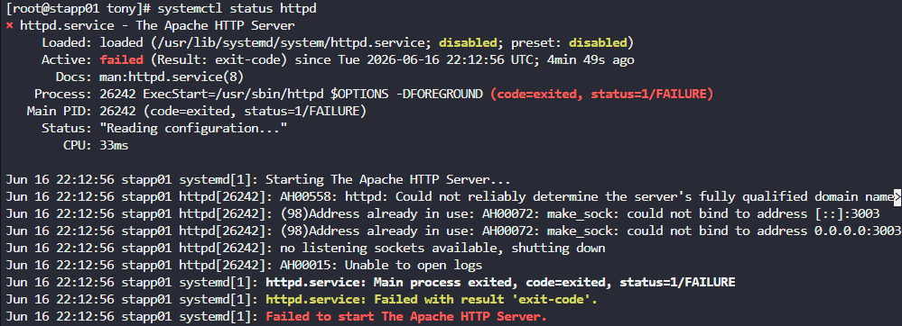
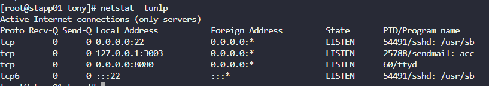

# Day 14 — Linux Process Troubleshooting

**Date:** 2026-06-17 | **Duration:** ~0.3h | **Status:** ✅ Complete

---

## 🎯 Objective

Identify and resolve service availability issues caused by port conflicts. Fix the Apache service running on port 3003 across all application servers by troubleshooting process and port usage problems.

---

## 📋 Problem Statement

The production support team at xFusionCorp Industries has detected Apache service unavailability on one of the application servers through their monitoring systems. The Apache service needs to be running on port 3003 on all app servers.

Key requirements:
- Identify which application server has Apache service issues
- Troubleshoot the root cause of the service failure
- Ensure Apache (httpd) service is running and listening on port 3003
- Resolve any port conflicts preventing the service from starting

---

## 📚 Prerequisites

- Access to multiple application servers (`stapp01`, `stapp02`, `stapp03`)
- SSH access with sudo privileges
- Knowledge of `curl`, `systemctl`, `netstat`, and configuration file editing
- Understanding of Linux services and port binding

---

## 💻 Step-by-Step Solution

### Step 1: Check Apache Service Availability on All Servers

**Description:**
From the jump host, test if Apache is responding on port 3003 on all application servers.

**Commands:**
```bash
curl stapp01:3003
curl stapp02:3003
curl stapp03:3003
```

**Expected Output:**
```
# Successful servers will return connection accepted or HTML
# Faulty server will return connection refused
```

**Finding:** In this case, `stapp01` was refusing the connection while `stapp02` and `stapp03` responded successfully.

---

### Step 2: SSH into the Problematic Server

**Description:**
Connect to the server with the failing Apache service to begin troubleshooting.

**Commands:**
```bash
ssh <username>@stapp01
sudo su
```

**Expected Output:**
```
# root prompt on stapp01
```

---

### Step 3: Check Apache Service Status

**Description:**
Check the current status of the httpd (Apache) service to see if it's running or what error it's reporting.

**Commands:**
```bash
systemctl status httpd
```

**Expected Output:**
```
● httpd.service - The Apache HTTP Server
   Loaded: loaded (/usr/lib/systemd/system/httpd.service; enabled; vendor preset: disabled)
   Active: inactive (dead) since [timestamp]
   Docs: man:httpd(8)
        man:systemctl(1)
   Main PID: [PID] (code=exited, status=1/FAILURE)
```

**Finding:** The service failed to start. The issue: "Address :3003 already in use" — another process is already listening on port 3003.

**Screenshot:**


---

### Step 4: Identify Which Service is Using Port 3003

**Description:**
Use `netstat` to check which process is currently using port 3003, preventing Apache from binding to it.

**Commands:**
```bash
netstat -tunlp | grep 3003
```

**Alternative Command:**
```bash
netstat -tunlp
# Look for port 3003 in the output
```

**Expected Output:**
```
tcp        0      0 0.0.0.0:3003            0.0.0.0:*               LISTEN      [PID]/sendmail
```

**Finding:** The `sendmail` service is occupying port 3003.

**Screenshot:**


---

### Step 5: Edit the Conflicting Service Configuration

**Description:**
Edit the sendmail configuration to use a different port instead of 3003, freeing up the port for Apache.

**Commands:**
```bash
vi /etc/mail/sendmail.cf
```

**Action:**
- Search for the port 3003 configuration (usually a line with `ClientPort` or similar)
- Change the port to an unused port (e.g., 3005 or higher)
- Save and exit

**Finding:** Located the sendmail configuration using port 3003 and changed it to port 3005.

**Screenshot:**


---

### Step 6: Restart the Sendmail Service

**Description:**
Restart sendmail to apply the configuration change and release port 3003.

**Commands:**
```bash
systemctl restart sendmail
```

**Expected Output:**
```
# Service restarts without errors (no output is typical for success)
```

---

### Step 7: Start the Apache Service

**Description:**
Now that port 3003 is available, restart the Apache service.

**Commands:**
```bash
systemctl restart httpd
```

**Expected Output:**
```
# Service starts without errors
```

---

### Step 8: Verify Apache is Running and Listening on Port 3003

**Description:**
Confirm that Apache is now running and listening on port 3003.

**Commands:**
```bash
systemctl status httpd
```

**Expected Output:**
```
● httpd.service - The Apache HTTP Server
   Loaded: loaded (/usr/lib/systemd/system/httpd.service; enabled; vendor preset: disabled)
   Active: active (running) since [timestamp]
   Main PID: [PID] (httpd)
   ...
```

---

### Step 9: Verify from Jump Host

**Description:**
Confirm from the jump host that Apache on the fixed server now responds to requests on port 3003.

**Commands:**
```bash
curl stapp01:3003
```

**Expected Output:**
```
# Should receive valid response (may be empty or error page, but connection is accepted)
# Connection refused error means it's still not working
```

---

## ✅ Verification

**How to verify the solution is correct:**
- [ ] All three application servers respond to `curl` on port 3003
- [ ] Apache service is `active (running)` on the previously problematic server
- [ ] `netstat` shows Apache listening on port 3003
- [ ] No port conflicts detected

**Verification Commands:**
```bash
# From jump host
curl stapp01:3003
curl stapp02:3003
curl stapp03:3003

# From the fixed server
netstat -tunlp | grep 3003
systemctl status httpd
```

---

## 📊 Results & Evidence

| Item | Details |
|------|---------|
| **Status** | ✅ Success |
| **Time Taken** | ~0.3h |
| **Root Cause** | Sendmail service using port 3003 |
| **Resolution** | Reconfigured sendmail to use port 3005 |
| **Affected Server** | stapp01 |
| **Service Status** | Apache running on all servers on port 3003 |

---

## 🔑 Key Concepts Learned

1. **Port conflict troubleshooting** — Services competing for the same port and how to identify them
2. **netstat tool** — Using `netstat -tunlp` to list all listening services and their processes
3. **Service management** — Starting, stopping, and restarting services with `systemctl`
4. **Configuration file editing** — Modifying `/etc/mail/sendmail.cf` to resolve conflicts
5. **Process-level debugging** — Identifying the root cause versus just the symptom
6. **System-wide port mapping** — Understanding which ports are in use across the system

---

## 💡 Troubleshooting Tips

- **Port already in use:** Always check what's using the port with `netstat -tunlp` before killing services
- **Service won't start:** Check `systemctl status [service]` for detailed error messages
- **Configuration locations:** Common service configs are in `/etc/` with service names (e.g., `/etc/mail/`, `/etc/httpd/`)
- **Avoid killing services:** Try reconfiguring services to use different ports rather than stopping them entirely
- **Verification is crucial:** Always verify the fix works from the jump host or external system

---

## 📚 Related Commands Reference

```bash
# Check service status
systemctl status [service]

# List all listening ports and processes
netstat -tunlp

# Find specific port
netstat -tunlp | grep [port-number]

# Restart a service
systemctl restart [service]

# Edit configuration files safely
vi /etc/[service]/config-file

# Test connectivity
curl [hostname]:[port]
ssh [user]@[hostname]
```

---

## 🎓 Lessons Learned

- Port conflicts are a common cause of service startup failures in production
- Systematic troubleshooting (test → identify → resolve) is more effective than random fixes
- Understanding service interdependencies is important for system administration
- Configuration management is as important as service management
- Always use diagnostic tools (`netstat`, `systemctl status`) before making changes

