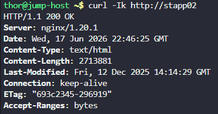
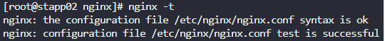
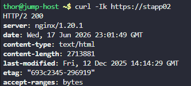

# Day 15 — Setup SSL for Nginx

**Date:** 2026-06-18 | **Duration:** ~0.5h | **Status:** ✅ Complete

---

## 🎯 Objective

Deploy and configure SSL/TLS certificates on Nginx running on App Server 2 to enable secure HTTPS connections.

---

## 📋 Problem Statement

The xFusionCorp Industries system admin team needs to prepare App Server 2 for application deployment with SSL/TLS security enabled. The server must serve content over HTTPS with a self-signed certificate.

Key requirements:
- Install and configure Nginx on App Server 2 (`stapp02`)
- Deploy SSL certificate and key from `/tmp/nautilus.crt` and `/tmp/nautilus.key`
- Configure Nginx to use the SSL certificates
- Create an `index.html` with "Welcome!" content
- Verify HTTPS connectivity from the jump host using `curl`

---

## 📚 Prerequisites

- Access to App Server 2 (`stapp02`) with SSH credentials
- Sudo access to escalate privileges
- SSL certificate and key files at `/tmp/nautilus.crt` and `/tmp/nautilus.key`
- Understanding of Nginx configuration and SSL/TLS setup
- Basic curl command knowledge for testing HTTPS connections

---

## 💻 Step-by-Step Solution

### Step 1: SSH to App Server 2 and Escalate to Root

**Description:**
Connect to App Server 2 using SSH credentials and switch to root user for administrative operations.

**Commands:**
```bash
ssh <username>@stapp02
sudo su
```

**Expected Output:**
```
# root prompt, e.g. root@stapp02:/#
```

---

### Step 2: Install Nginx

**Description:**
Install the Nginx web server package on App Server 2 using the package manager.

**Commands:**
```bash
yum install nginx -y
```

**Expected Output:**
```
Complete!
```

---

### Step 3: Start the Nginx Service

**Description:**
Enable and start the Nginx service to ensure it runs properly.

**Commands:**
```bash
systemctl start nginx
```

**Expected Output:**
```
# No output indicates success
```

---

### Step 4: Test HTTP Connection (Before SSL)

**Description:**
From the jump host, verify that HTTP connectivity to App Server 2 is working before configuring SSL.

**Commands (from jump host):**
```bash
curl -Ik http://stapp02
```

**Expected Output:**
```
HTTP/1.1 200 OK
Server: nginx/1.14.1
```

**Screenshot:**


---

### Step 5: Prepare SSL Certificate Directory

**Description:**
Create a dedicated directory in Nginx configuration path to store SSL certificates and keys.

**Commands:**
```bash
cd /etc/nginx
mkdir certs
```

**Expected Output:**
```
# Directory created successfully
```

---

### Step 6: Copy SSL Certificates and Key

**Description:**
Copy the provided SSL certificate and private key from temporary location to the Nginx certs directory.

**Commands:**
```bash
cp /tmp/nautilus.crt /etc/nginx/certs/server.crt
cp /tmp/nautilus.key /etc/nginx/certs/server.key
chmod 600 server.key
chmod 644 server.crt
```

**Expected Output:**
```
# Files copied successfully
```

---

### Step 7: Configure Nginx for SSL/TLS

**Description:**
Edit the Nginx configuration file to enable SSL/TLS. Locate the commented SSL server block and uncomment it with proper certificate paths.

**Commands:**
```bash
vi /etc/nginx/nginx.conf
```

**Configuration to Update:**
Find the SSL server block (typically commented) and modify it to:

```nginx
server {
    listen       443 ssl http2;
    listen       [::]:443 ssl http2;
    server_name  _;
    root         /usr/share/nginx/html;

    ssl_certificate "/etc/nginx/certs/server.crt";
    ssl_certificate_key "/etc/nginx/certs/server.key";
    ssl_session_cache shared:SSL:1m;
    ssl_session_timeout  10m;
    ssl_ciphers PROFILE=SYSTEM;
    ssl_prefer_server_ciphers on;

    # Load configuration files for the default server block.
    include /etc/nginx/default.d/*.conf;

    error_page 404 /404.html;
        location = /40x.html {
    }

    error_page 500 502 503 504 /50x.html;
        location = /50x.html {
    }
}
```

**Save and Exit:**
```
:wq
```

---

### Step 8: Validate Nginx Configuration

**Description:**
Test the Nginx configuration syntax to ensure all changes are correct before restarting the service.

**Commands:**
```bash
nginx -t
```

**Expected Output:**
```
nginx: the configuration file /etc/nginx/nginx.conf syntax is ok
nginx: configuration file /etc/nginx/nginx.conf test is successful
```

**Screenshot:**


---

### Step 9: Restart Nginx Service

**Description:**
Restart the Nginx service to apply the SSL configuration changes.

**Commands:**
```bash
systemctl restart nginx
```

**Expected Output:**
```
# No output indicates success
```

---

### Step 10: Create Welcome Index Page

**Description:**
Create an `index.html` file in the Nginx document root with the "Welcome!" message.

**Commands:**
```bash
echo "Welcome!" | sudo tee /usr/share/nginx/html/index.html
```

**Expected Output:**
```
Welcome!
```

---

### Step 11: Verify HTTPS Connection (Final Testing)

**Description:**
From the jump host, test the HTTPS connection to verify SSL is working correctly and the welcome page is served.

**Commands (from jump host):**
```bash
curl -Ik https://stapp02
```

**Expected Output:**
```
HTTP/1.1 200 OK
Server: nginx/1.14.1
Content-Type: text/html; charset=UTF-8
SSL certificate headers are present
```

**Screenshot:**


---

## ✅ Verification

**How to verify the solution is correct:**
- [ ] Nginx is installed and running on stapp02
- [ ] SSL certificate and key are copied to `/etc/nginx/certs/`
- [ ] Nginx configuration includes uncommented SSL server block with correct certificate paths
- [ ] `nginx -t` returns successful configuration test
- [ ] HTTP connection works (Step 4)
- [ ] HTTPS connection works with valid SSL headers (Step 11)
- [ ] Index page returns "Welcome!" message over HTTPS

**Verification Commands:**
```bash
# Check if Nginx is running
systemctl status nginx

# Verify certificate files exist
ls -la /etc/nginx/certs/

# Test Nginx config
nginx -t

# Test from jump host
curl -Ik https://stapp02
curl https://stapp02
```

---

## 📊 Results & Evidence

| Item | Details |
|------|---------|
| **Status** | ✅ Success |
| **Time Taken** | ~0.5h |
| **Server** | App Server 2 (stapp02) |
| **Service** | Nginx with SSL/TLS |
| **Key Output** | HTTPS working with valid SSL certificate |

---

## 🔑 Key Concepts Learned

1. **SSL/TLS certificate deployment** — Moving and configuring self-signed certificates for web servers
2. **Nginx SSL configuration** — Modifying Nginx config to enable HTTPS with certificate paths
3. **SSL server blocks in Nginx** — Understanding how to configure separate server blocks for HTTPS
4. **Certificate path management** — Organizing certificates in dedicated directories for security and maintainability
5. **Configuration validation** — Using `nginx -t` to test configuration before applying changes
6. **HTTPS connectivity testing** — Verifying secure connections with curl using `-k` (insecure) flag for self-signed certs

---

## ⚠️ Common Mistakes & Troubleshooting

### Issue 1: Certificate path not found in nginx.conf
**Cause:** Incorrect path or certificate not copied to the expected location
**Solution:** Verify certificate paths in nginx.conf match actual file locations:

```bash
# Check if files exist
ls -la /etc/nginx/certs/server.crt
ls -la /etc/nginx/certs/server.key

# Update paths in nginx.conf if needed
vi /etc/nginx/nginx.conf
```

### Issue 2: Nginx configuration test fails
**Cause:** Syntax error in nginx.conf modifications
**Solution:** Check the error message from `nginx -t` and correct the syntax:

```bash
nginx -t
# Review the error and fix the specific line in nginx.conf
```

### Issue 3: HTTPS returns certificate error in curl
**Cause:** Using incorrect certificate or key path
**Solution:** Use `curl -Ik` to ignore certificate verification and verify connectivity:

```bash
curl -Ik https://stapp02
```

### Issue 4: Nginx service fails to restart
**Cause:** Configuration syntax error or port already in use
**Solution:** Run configuration test and check service status:

```bash
nginx -t
systemctl status nginx
```

---

## 📌 Key Takeaways

- **What worked well:** Following the structured approach of installing Nginx, preparing SSL infrastructure, configuring the service, and validating with testing
- **What was challenging:** Ensuring correct certificate paths in the configuration file and understanding Nginx SSL server block structure
- **Next steps:** Practice with additional SSL certificate scenarios and explore certificate pinning for enhanced security

---

## 🔗 Resources & References

- [Nginx official documentation](https://nginx.org/en/docs/)
- [Mozilla SSL Configuration Generator](https://ssl-config.mozilla.org/)
- [SSL/TLS Certificate Basics](https://en.wikipedia.org/wiki/Transport_Layer_Security)
- [Nginx Server Block Documentation](https://nginx.org/en/docs/http/ngx_http_core_module.html#server)

---

## 📁 Files & Configurations

### Files Used/Modified:
- `/etc/nginx/nginx.conf` — Main Nginx configuration file (SSL server block added)
- `/etc/nginx/certs/server.crt` — SSL certificate file (copied from `/tmp/nautilus.crt`)
- `/etc/nginx/certs/server.key` — SSL private key file (copied from `/tmp/nautilus.key`)
- `/usr/share/nginx/html/index.html` — Welcome page content

### Useful Commands:
```bash
# SSH and escalate
ssh <username>@stapp02
sudo su

# Install and manage Nginx
yum install nginx -y
systemctl start nginx
systemctl status nginx
systemctl restart nginx

# Configuration validation
nginx -t

# Testing connections
curl -Ik http://stapp02
curl -Ik https://stapp02
curl https://stapp02
```

---

*Challenge completed successfully! SSL/TLS is now configured on Nginx for secure communication on App Server 2.*
