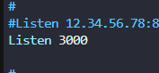
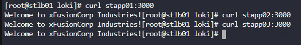
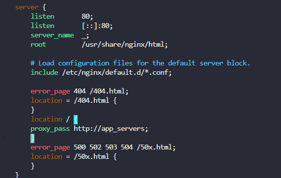

# Day 16 — Install Nginx Load Balancer

**Date:** 2026-06-21 | **Duration:** ~0.5h | **Status:** ✅ Complete

---

## 🎯 Objective

Configure an Nginx load balancer on the LBR (Load Balancer) server to distribute incoming traffic across three application servers, improving website performance and enabling high availability.

---

## 📋 Problem Statement

The Nautilus production support team has observed degradation in website performance due to increasing traffic. To address this, the team has decided to deploy the application on a high availability stack in the Stratos DC. The migration is almost complete, with only the LBR server configuration pending.

Key requirements:
- Install Nginx on the LBR (load balancer) server
- Configure load-balancing in the HTTP context using all three App Servers (`stapp01`, `stapp02`, `stapp03`)
- Update only the main Nginx configuration file at `/etc/nginx/nginx.conf`
- Ensure Apache ports remain unchanged on all app servers
- Verify Apache services are running on all app servers
- Test load balancer accessibility via `curl http://stlb01:80`

---

## 📚 Prerequisites

- SSH access to the LBR server (`stlb01`) with sudo privileges
- Access to App Servers 1, 2, and 3 to verify their listening ports
- Apache services running on all app servers
- Basic understanding of Nginx configuration and upstream proxy setup
- Knowledge of load balancing concepts

---

## 💻 Step-by-Step Solution

### Step 1: SSH to the LBR Server and Escalate Privileges

**Description:**
Connect to the Load Balancer server using SSH credentials and switch to root user for administrative operations.

**Commands:**
```bash
ssh <username>@stlb01
sudo su
```

**Expected Output:**
```
[root@stlb01 ~]#
```

---

### Step 2: Install Nginx Service

**Description:**
Install Nginx using yum package manager, then start and enable the service to ensure it runs on system restart.

**Commands:**
```bash
yum install nginx -y
systemctl start nginx
systemctl enable nginx
```

**Expected Output:**
```
Loaded plugins: fastestmirror, security
Loading mirror speeds from cached hostfile
Resolving Dependencies
--> Running transaction check
---> Package nginx.x86_64 0:1.20.1-14.el7 will be installed
...
Installed:
  nginx.x86_64 0:1.20.1-14.el7

Complete!
Created symlink from /etc/systemd/system/multi-user.target.wants/nginx.service to /etc/systemd/system/nginx.service.
```

### Step 3: Navigate to the Nginx Configuration File

**Description:**
Open the main Nginx configuration file for editing. This is where we'll define the upstream servers and load balancing rules.

**Commands:**
```bash
vi /etc/nginx/nginx.conf
```

---

### Step 4: Retrieve Application Server Listening Ports

**Description:**
Connect to each application server in a separate terminal to determine which port Apache is listening on. This information is needed to configure the upstream servers in the load balancer.

**Commands (from jump host or in a new terminal):**
```bash
# SSH to each app server and check the Apache listening port
ssh <username>@stapp01
sudo su
vi /etc/httpd/conf/httpd.conf
# Search for "Listen" directive to find the port (typically port 3000)

# Repeat for stapp02 and stapp03
```

**Expected Output:**
```
Listen 3000
```



---

### Step 5: Configure Upstream Servers in Nginx

**Description:**
In the Nginx configuration file, add an upstream block that defines all three application servers. This block should be placed between the `http {}` context and before the `server {}` block.

**Configuration to Add:**
```nginx
upstream app_servers {
    server stapp01:3000;
    server stapp02:3000;
    server stapp03:3000;
}
```

**Location in File:**
Place this configuration after `http {` and before `server {`:

```nginx
http {
    # ... other directives ...
    
    upstream app_servers {
        server stapp01:3000;
        server stapp02:3000;
        server stapp03:3000;
    }
    
    server {
        # ... server configuration ...
    }
}
```

**Commands:**
```bash
# In vi editor
:set nu              # Show line numbers to find the right location
# Navigate to the appropriate position and insert the upstream block
# Save and exit
:wq
```

---

### Step 6: Verify Connectivity to Application Servers

**Description:**
Test connectivity from the load balancer to each application server to ensure they are reachable and responding on the configured port.

**Commands (from LBR server):**
```bash
curl stapp01:3000
curl stapp02:3000
curl stapp03:3000
```

**Expected Output:**
```
<!DOCTYPE html>
<html>
<head>
    <title>Welcome</title>
</head>
<body>
    <h1>Welcome to App Server 1</h1>
</body>
</html>
```



---

### Step 7: Configure Load Balancing in Nginx

**Description:**
Edit the Nginx configuration again to add the location block that proxies requests to the upstream servers. This enables the actual load balancing functionality.

**Commands:**
```bash
vi /etc/nginx/nginx.conf
```

**Configuration to Add (within the server block):**
```nginx
server {
    listen 80;
    
    # ... other directives ...
    
    location / {
        proxy_pass http://app_servers;
    }
    
    # ... error pages ...
}
```

**Visual Placement:**
```nginx
server {
    listen       80;
    server_name  _;
    
    location / {
        proxy_pass http://app_servers;
    }
    
    error_page   404 /404.html;
    # ... other error pages ...
}
```



**Commands:**
```bash
# In vi editor, navigate to the location section
# Add the proxy_pass directive under location /
# Save and exit
:wq
```

---

### Step 8: Test Nginx Configuration

**Description:**
Verify that the Nginx configuration syntax is correct before restarting the service.

**Commands:**
```bash
nginx -t
```

**Expected Output:**
```
nginx: the configuration file /etc/nginx/nginx.conf syntax is ok
nginx: configuration file /etc/nginx/nginx.conf test is successful
```


---

### Step 9: Reload Nginx Service

**Description:**
Reload the Nginx service to apply the configuration changes without interrupting existing connections.

**Commands:**
```bash
systemctl reload nginx
```

**Expected Output:**
```
[root@stlb01 ~]# systemctl reload nginx
[root@stlb01 ~]#
```

---

### Step 10: Verify Load Balancer Functionality (Confirmation)

**Description:**
Test the load balancer by accessing it from any terminal (jump host or LBR server). Each request should be distributed across the three application servers due to round-robin load balancing.

**Commands (from jump host or any accessible terminal):**
```bash
curl http://stlb01:80
```

**Expected Output:**
HTML content from one of the application servers (response may vary due to round-robin distribution):
```
<!DOCTYPE html>
<html>
<head>
    <title>Welcome</title>
</head>
<body>
    <h1>Welcome to App Server [1/2/3]</h1>
</body>
</html>
```


**Additional Verification:**
```bash
# Run multiple times to see load balancing in action
curl http://stlb01:80
curl http://stlb01:80
curl http://stlb01:80
```

---

## 🔍 Key Concepts

### Upstream Blocks
- Define a pool of backend servers that will receive proxied requests
- Enable load balancing across multiple backend servers
- Nginx uses round-robin by default to distribute requests

### Proxy Pass
- Routes requests to the specified upstream servers
- Maintains HTTP headers and connection handling
- Enables transparent proxying from client to backend servers

### Load Balancing Methods
- **Round-robin (default)**: Requests are distributed evenly across servers
- **Least connections**: Requests go to server with fewest active connections
- **IP hash**: Client IP determines which server receives the request

---

## ✅ Verification Checklist

- [ ] Nginx installed and running on LBR server
- [ ] Upstream block configured with all three app servers
- [ ] Nginx configuration syntax is valid (`nginx -t` passes)
- [ ] All app servers are reachable from LBR server
- [ ] Load balancer responds to `curl http://stlb01:80`
- [ ] Apache services remain running on all app servers
- [ ] Load balancing is working (requests distributed across servers)

---

## 🛠️ Troubleshooting

| Issue | Solution |
|-------|----------|
| Nginx configuration test fails | Check syntax in `/etc/nginx/nginx.conf`, ensure proper brackets and semicolons |
| Cannot reach app servers | Verify Apache is running on app servers, check firewall rules, confirm port numbers |
| Load balancer returns 502 Bad Gateway | Verify upstream servers are reachable, check proxy_pass configuration, review Nginx error logs |
| Nginx service fails to start | Check `/var/log/nginx/error.log` for detailed error messages |
| Round-robin not distributing evenly | Verify all upstream servers are healthy, check for connection pooling issues |

---

## 📚 Additional Resources

- Nginx Load Balancing: https://nginx.org/en/docs/http/load_balancing.html
- Upstream Module: https://nginx.org/en/docs/http/ngx_http_upstream_module.html
- Proxy Module: https://nginx.org/en/docs/http/ngx_http_proxy_module.html

---

## 📝 Summary

Successfully configured Nginx as a load balancer on the LBR server (`stlb01`), distributing traffic across three application servers (`stapp01`, `stapp02`, `stapp03`). The configuration uses upstream blocks and proxy_pass directives to achieve round-robin load balancing, improving website performance and enabling high availability for the Nautilus infrastructure.

