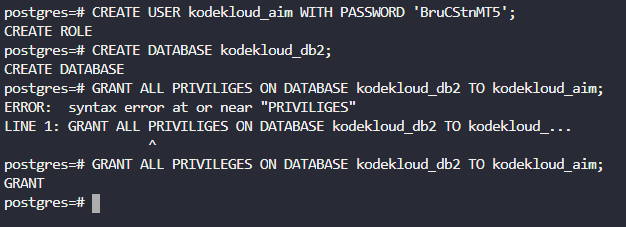

# Day 17 — PostgreSQL Database Configuration

**Date:** 2026-06-21 | **Duration:** ~0.3h | **Status:** ✅ Complete

---

## 🎯 Objective

Configure the PostgreSQL database server on the Nautilus Database Server by creating a database user and granting full permissions on a newly created database to support application deployment.

---

## 📋 Problem Statement

The Nautilus application development team is planning to deploy a new application on the Nautilus infrastructure in Stratos DC. The application requires a PostgreSQL database with specific user and database configurations.

Key requirements:
- PostgreSQL database server is already installed on the Nautilus database server
- Create a database user named `kodekloud_aim` with password `BruCStnMT5`
- Create a database named `kodekloud_db2`
- Grant full permissions (ALL PRIVILEGES) on `kodekloud_db2` to the user `kodekloud_aim`
- Do not restart the PostgreSQL server service

---

## 📚 Prerequisites

- SSH access to the Nautilus Database Server (`stdb01`)
- Ability to escalate to root with `sudo su`
- PostgreSQL server is already installed and running on the database server
- Knowledge of PostgreSQL user and database management
- Familiarity with `sudo -u` command to switch user context

---

## 💻 Step-by-Step Solution

### Step 1: SSH to the Nautilus Database Server and Escalate to Root

**Description:**
Connect to the Nautilus Database Server using SSH and switch to the root user to perform database administration tasks.

**Commands:**
```bash
ssh <username>@stdb01
sudo su
```

**Expected Output:**
```
# root@stdb01:/#  (or similar root prompt)
```

---

### Step 2: Access the PostgreSQL Shell as the postgres User

**Description:**
Switch to the PostgreSQL system user account and open the PostgreSQL interactive terminal (`psql`). This allows you to execute PostgreSQL commands with proper permissions.

**Commands:**
```bash
sudo -u postgres psql
```

**Expected Output:**
```
psql (XX.XX)
Type "help" for help.

postgres=#
```

---

### Step 3: Create the Database User `kodekloud_aim`

**Description:**
In the PostgreSQL shell, create a new database user named `kodekloud_aim` with the specified password.

**Commands:**
```sql
CREATE USER kodekloud_aim WITH PASSWORD 'BruCStnMT5';
```

**Expected Output:**
```
CREATE ROLE
```

---

### Step 4: Create the Database `kodekloud_db2`

**Description:**
Create a new PostgreSQL database named `kodekloud_db2` that will be used by the application.

**Commands:**
```sql
CREATE DATABASE kodekloud_db2;
```

**Expected Output:**
```
CREATE DATABASE
```

---

### Step 5: Grant Full Permissions to `kodekloud_aim` on `kodekloud_db2`

**Description:**
Grant ALL PRIVILEGES on the `kodekloud_db2` database to the `kodekloud_aim` user. This allows the user to perform all database operations on this database.

**Commands:**
```sql
GRANT ALL PRIVILEGES ON DATABASE kodekloud_db2 TO kodekloud_aim;
```

**Expected Output:**
```
GRANT
```

**Screenshot:**


---

## 📝 Summary

This task demonstrates fundamental PostgreSQL database administration:
- Creating database users with specific credentials
- Creating databases for applications
- Managing database access control through role-based permissions
- Understanding PostgreSQL shell commands and SQL syntax

The configuration allows the `kodekloud_aim` user to fully manage the `kodekloud_db2` database, making it suitable for application connection and operation.

---

## ⚠️ Important Notes

- Do **not** restart the PostgreSQL server service
- The password `BruCStnMT5` should be kept secure
- PostgreSQL was pre-installed, so no installation steps were required
- All commands are case-insensitive in SQL, but it's best practice to use uppercase for SQL keywords
